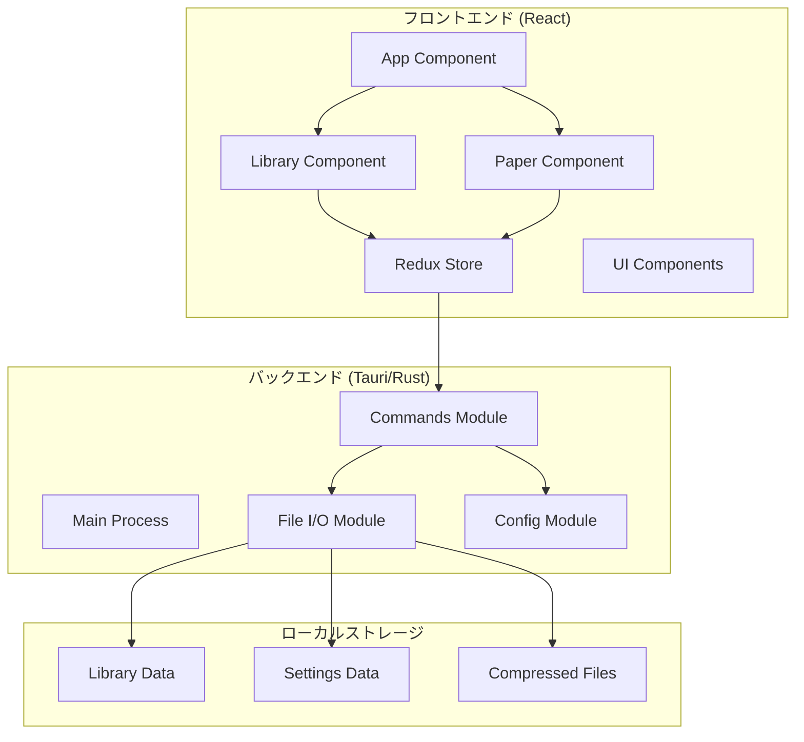
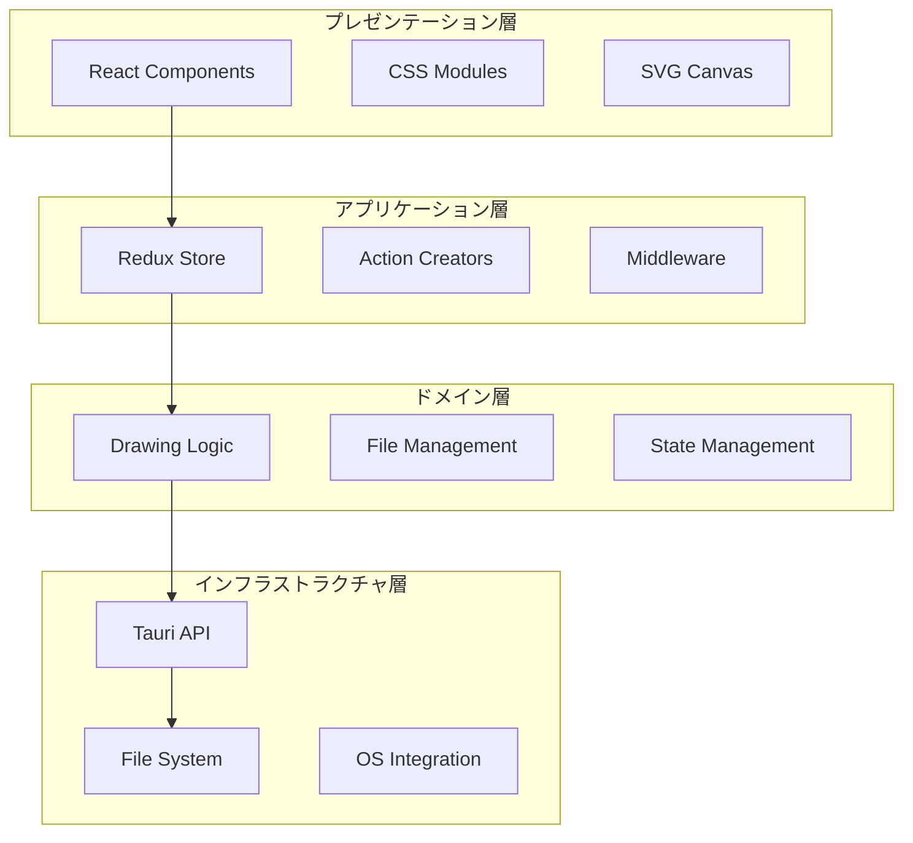
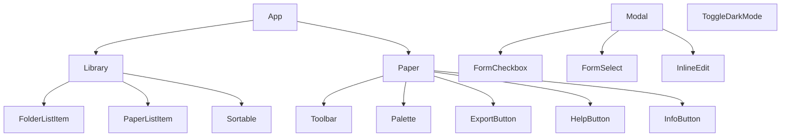
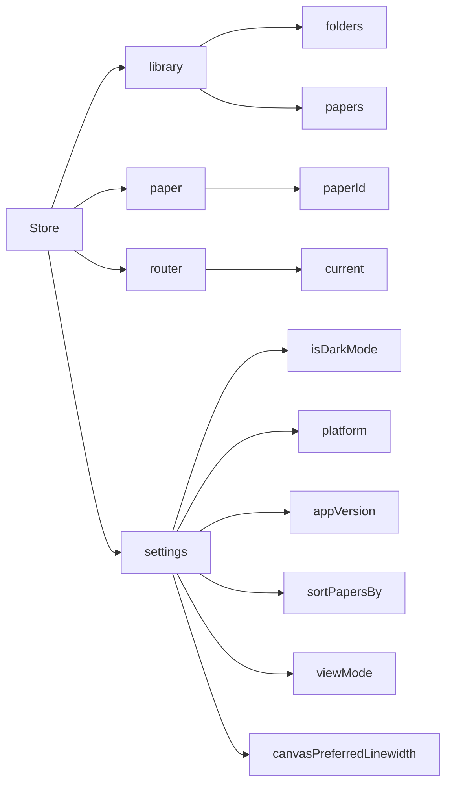
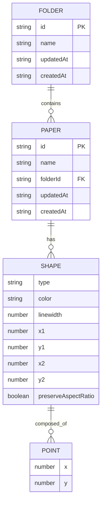

# Pointlessアプリケーション設計書

## 概要

Pointlessは、React + Tauri (Rust) で構築された無限描画キャンバスデスクトップアプリケーションです。SVGベースの描画機能、ローカルファイル保存、フォルダ管理、テーマ切り替えなどの機能を提供します。本設計書では、アプリケーションの全体的なアーキテクチャ、コンポーネント構成、データモデル、インタフェース仕様を詳細に記載します。

## アーキテクチャ

### システム全体構成



### レイヤー構成



## コンポーネントとインタフェース

### フロントエンドコンポーネント階層



### Redux Store構成



## データモデル

### 主要データ構造

#### Folder Model
```typescript
interface Folder {
  id: string;           // UUID
  name: string;         // フォルダ名
  updatedAt: string;    // ISO 8601 形式
  createdAt: string;    // ISO 8601 形式
}
```

#### Paper Model
```typescript
interface Paper {
  id: string;           // UUID
  name: string;         // ペーパー名
  folderId: string;     // 所属フォルダID
  shapes: Shape[];      // 描画シェイプ配列
  updatedAt: string;    // ISO 8601 形式
  createdAt: string;    // ISO 8601 形式
}
```

#### Shape Model
```typescript
interface Shape {
  type: 'FREEHAND' | 'RECTANGLE' | 'ELLIPSE' | 'ARROW' | 'SELECT';
  color: string;        // Hex color code
  linewidth: number;    // 線の太さ
  points: Point[];      // 座標点配列
  x1?: number;         // 矩形・楕円・矢印用
  y1?: number;
  x2?: number;
  y2?: number;
  preserveAspectRatio?: boolean; // Shift押下時の比率保持
}
```

#### Point Model
```typescript
interface Point {
  x: number;
  y: number;
}
```

#### Settings Model
```typescript
interface Settings {
  isDarkMode: boolean;
  platform: string;
  appVersion: string;
  sortPapersBy: number;           // SORT_BY enum
  viewMode: number;               // VIEW_MODE enum
  canvasPreferredLinewidth: number; // LINEWIDTH enum
}
```

### データ関係図



## エラーハンドリング

### フロントエンドエラーハンドリング
- Redux middleware でのエラーキャッチ
- コンポーネントレベルでのエラーバウンダリ
- ユーザー操作エラーの適切な通知

### バックエンドエラーハンドリング
- ファイルI/O操作の例外処理
- データ圧縮・展開エラーの処理
- JSON パースエラーの処理

## テスト戦略

### フロントエンドテスト
- Jest + React Testing Library によるコンポーネントテスト
- Redux store のユニットテスト
- 描画ロジックの統合テスト

### バックエンドテスト
- Rust の標準テストフレームワークによるユニットテスト
- ファイルI/O操作のテスト
- Tauri コマンドのテスト

### E2Eテスト
- 描画機能の動作テスト
- ファイル保存・読み込みテスト
- UI操作フローテスト

## パフォーマンス考慮事項

### 描画パフォーマンス
- SVG要素の効率的な更新
- 大量のシェイプ描画時の最適化
- Canvas要素の再描画最小化

### メモリ管理
- 履歴データの適切な管理
- 不要なオブジェクトの解放
- 大きなファイルの処理最適化

### ファイルI/O最適化
- Brotli圧縮による高効率データ保存
- 非同期ファイル操作
- バッチ処理による I/O 削減

## セキュリティ考慮事項

### データ保護
- ローカルファイルの適切な権限設定
- ユーザーデータの暗号化検討
- 不正なファイルアクセスの防止

### 入力検証
- ユーザー入力の適切なサニタイゼーション
- ファイル名の安全性チェック
- JSON データの検証

## 拡張性設計

### プラグインアーキテクチャ
- 新しい描画ツールの追加容易性
- エクスポート形式の拡張可能性
- テーマシステムの柔軟性

### 国際化対応
- 多言語サポートの基盤
- 地域固有の設定対応
- 文字エンコーディング対応
