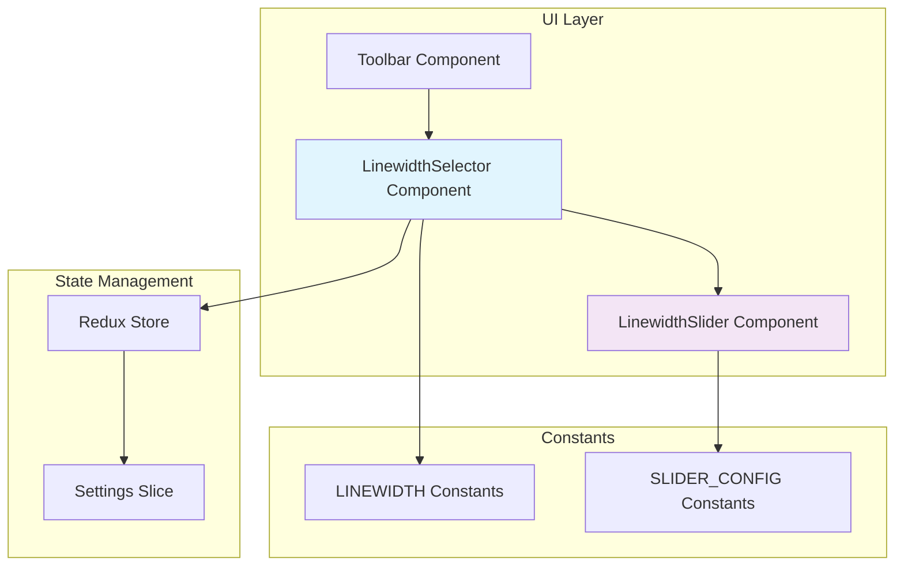
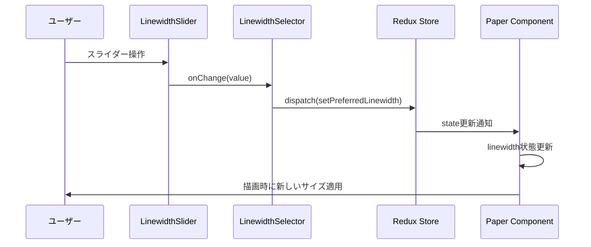

# 設計書

## 概要

現在のPointlessアプリケーションのラインサイズ選択機能を拡張し、従来の3つの固定サイズ（小・中・大）に加えて、スライダーによる1px〜20pxの自由なサイズ選択を可能にします。この機能により、ユーザーはより細かい表現制御が可能になります。

## アーキテクチャ

### システム構成図



### データフロー



## コンポーネント設計

### 1. LinewidthSelector Component

#### 責務
- 従来の3つのボタンとスライダーの統合管理
- Redux状態との同期
- プリセット値とカスタム値の切り替え制御

#### Props Interface
```typescript
interface LinewidthSelectorProps {
  linewidth: number;
  isDrawMode: boolean;
  onLinewidthChange: (value: number) => void;
}
```

#### State管理
```typescript
interface LinewidthSelectorState {
  isSliderMode: boolean;  // スライダーモードかプリセットモードか
  sliderValue: number;    // スライダーの現在値
}
```

#### 実装構造
```jsx
function LinewidthSelector({ linewidth, isDrawMode, onLinewidthChange }) {
  const [isSliderMode, setIsSliderMode] = useState(false);
  const [sliderValue, setSliderValue] = useState(linewidth);

  // プリセットボタンの描画
  const renderPresetButtons = () => { /* ... */ };
  
  // スライダーの描画
  const renderSlider = () => { /* ... */ };
  
  // モード切り替えボタン
  const renderModeToggle = () => { /* ... */ };

  return (
    <div className={styles.linewidthSelector}>
      {renderPresetButtons()}
      {renderModeToggle()}
      {isSliderMode && renderSlider()}
    </div>
  );
}
```

### 2. LinewidthSlider Component

#### 責務
- スライダーUIの描画と操作処理
- リアルタイムプレビューの表示
- 値の範囲制限とステップ制御

#### Props Interface
```typescript
interface LinewidthSliderProps {
  value: number;
  min: number;
  max: number;
  step: number;
  disabled: boolean;
  onChange: (value: number) => void;
  onChangeComplete?: (value: number) => void;
}
```

#### 実装仕様
```jsx
function LinewidthSlider({ 
  value, 
  min = 1, 
  max = 20, 
  step = 1, 
  disabled, 
  onChange, 
  onChangeComplete 
}) {
  const handleSliderChange = (newValue) => {
    onChange(newValue);
  };

  const handleSliderChangeComplete = (newValue) => {
    onChangeComplete?.(newValue);
  };

  return (
    <div className={styles.sliderContainer}>
      <input
        type="range"
        min={min}
        max={max}
        step={step}
        value={value}
        disabled={disabled}
        onChange={(e) => handleSliderChange(Number(e.target.value))}
        onMouseUp={(e) => handleSliderChangeComplete(Number(e.target.value))}
        className={styles.slider}
      />
      <div className={styles.valueDisplay}>
        {value}px
      </div>
      <div 
        className={styles.previewCircle}
        style={{ 
          width: `${Math.max(value, 4)}px`, 
          height: `${Math.max(value, 4)}px` 
        }}
      />
    </div>
  );
}
```

### 3. 既存Toolbarコンポーネントの修正

#### 変更点
- LinewidthSelectorコンポーネントの統合
- 従来の3つのボタンをLinewidthSelectorに移管
- レイアウト調整

#### 修正後の構造
```jsx
function Toolbar(props) {
  return (
    <div className={styles.toolbar__container}>
      <LinewidthSelector
        linewidth={props.linewidth}
        isDrawMode={props.isDrawMode}
        onLinewidthChange={props.onLinewidthChange}
      />
      <div className={styles.toolbar__item-separator} />
      {/* 他のツールボタン */}
    </div>
  );
}
```

## データモデル

### 定数の拡張

#### 新しい定数定義
```javascript
// src/components/Paper/constants.js に追加
export const LINEWIDTH_SLIDER = {
  MIN: 1,
  MAX: 20,
  STEP: 1,
  DEFAULT: 2,
};

export const LINEWIDTH_PRESETS = [
  { key: 'SMALL', value: 2, label: 'small stroke width' },
  { key: 'MEDIUM', value: 5, label: 'medium stroke width' },
  { key: 'LARGE', value: 8, label: 'large stroke width' },
];
```

#### 既存定数の保持
```javascript
// 後方互換性のため既存定数は維持
export const LINEWIDTH = {
  SMALL: 2,
  MEDIUM: 5,
  LARGE: 8,
};
```

### Redux State拡張

#### Settings Sliceの拡張
```typescript
interface SettingsState {
  // 既存フィールド
  isDarkMode: boolean;
  platform: string;
  appVersion: string;
  sortPapersBy: number;
  viewMode: number;
  canvasPreferredLinewidth: number;
  
  // 新規追加フィールド
  linewidthSliderMode: boolean;  // スライダーモードの状態
}
```

#### 新しいAction
```javascript
// settingsSlice.js に追加
setLinewidthSliderMode: (state, action) => {
  state.linewidthSliderMode = action.payload;
},
```

## インターフェース仕様

### コンポーネント間インターフェース

#### Paper → Toolbar
```typescript
interface ToolbarProps {
  // 既存props
  mode: string;
  linewidth: number;
  isDrawMode: boolean;
  onLinewidthChange: (value: number) => void;
  
  // 変更なし - 既存インターフェースを維持
}
```

#### Toolbar → LinewidthSelector
```typescript
interface LinewidthSelectorProps {
  linewidth: number;
  isDrawMode: boolean;
  onLinewidthChange: (value: number) => void;
}
```

#### LinewidthSelector → LinewidthSlider
```typescript
interface LinewidthSliderProps {
  value: number;
  min: number;
  max: number;
  step: number;
  disabled: boolean;
  onChange: (value: number) => void;
  onChangeComplete?: (value: number) => void;
}
```

### Redux インターフェース

#### Action Creators
```typescript
// 既存
setPreferredLinewidth: (value: number) => Action

// 新規追加
setLinewidthSliderMode: (enabled: boolean) => Action
```

#### Selectors
```typescript
// 既存
const selectPreferredLinewidth = (state: RootState) => 
  state.settings.canvasPreferredLinewidth;

// 新規追加
const selectLinewidthSliderMode = (state: RootState) => 
  state.settings.linewidthSliderMode;

const selectIsPresetLinewidth = (state: RootState) => {
  const linewidth = state.settings.canvasPreferredLinewidth;
  return Object.values(LINEWIDTH).includes(linewidth);
};
```

## エラーハンドリング

### 入力値検証

#### スライダー値の検証
```javascript
const validateLinewidth = (value) => {
  const numValue = Number(value);
  
  if (isNaN(numValue)) {
    return LINEWIDTH_SLIDER.DEFAULT;
  }
  
  return Math.max(
    LINEWIDTH_SLIDER.MIN,
    Math.min(LINEWIDTH_SLIDER.MAX, Math.round(numValue))
  );
};
```

#### 設定値の復元処理
```javascript
const loadLinewidthSettings = (savedSettings) => {
  const linewidth = savedSettings.canvasPreferredLinewidth;
  
  // 範囲外の値の場合はデフォルト値を使用
  if (linewidth < LINEWIDTH_SLIDER.MIN || linewidth > LINEWIDTH_SLIDER.MAX) {
    return LINEWIDTH_SLIDER.DEFAULT;
  }
  
  return linewidth;
};
```

### フォールバック処理

#### スライダー無効化時の処理
```javascript
const handleSliderDisabled = (currentLinewidth) => {
  // 現在の値がプリセット値でない場合、最も近いプリセット値を選択
  const presetValues = Object.values(LINEWIDTH);
  const closest = presetValues.reduce((prev, curr) => 
    Math.abs(curr - currentLinewidth) < Math.abs(prev - currentLinewidth) 
      ? curr : prev
  );
  
  return closest;
};
```

## テスト戦略

### 単体テスト

#### LinewidthSlider Component
```javascript
describe('LinewidthSlider', () => {
  test('スライダー値の変更が正しく処理される', () => {
    const mockOnChange = jest.fn();
    render(<LinewidthSlider value={5} onChange={mockOnChange} />);
    
    const slider = screen.getByRole('slider');
    fireEvent.change(slider, { target: { value: '10' } });
    
    expect(mockOnChange).toHaveBeenCalledWith(10);
  });

  test('無効化状態で操作が無効になる', () => {
    const mockOnChange = jest.fn();
    render(<LinewidthSlider value={5} disabled onChange={mockOnChange} />);
    
    const slider = screen.getByRole('slider');
    expect(slider).toBeDisabled();
  });

  test('範囲外の値が制限される', () => {
    render(<LinewidthSlider value={25} min={1} max={20} />);
    
    const slider = screen.getByRole('slider');
    expect(slider.value).toBe('20');
  });
});
```

#### LinewidthSelector Component
```javascript
describe('LinewidthSelector', () => {
  test('プリセットボタンクリックでスライダーが同期する', () => {
    const mockOnChange = jest.fn();
    render(<LinewidthSelector linewidth={2} onLinewidthChange={mockOnChange} />);
    
    const mediumButton = screen.getByLabelText('medium stroke width');
    fireEvent.click(mediumButton);
    
    expect(mockOnChange).toHaveBeenCalledWith(5);
  });

  test('スライダーモード切り替えが正しく動作する', () => {
    render(<LinewidthSelector linewidth={2} onLinewidthChange={jest.fn()} />);
    
    const toggleButton = screen.getByLabelText('toggle slider mode');
    fireEvent.click(toggleButton);
    
    expect(screen.getByRole('slider')).toBeInTheDocument();
  });
});
```

### 統合テスト

#### Redux統合テスト
```javascript
describe('Linewidth Redux Integration', () => {
  test('スライダー値変更がRedux状態に反映される', () => {
    const store = createMockStore({
      settings: { canvasPreferredLinewidth: 2 }
    });

    render(
      <Provider store={store}>
        <Toolbar linewidth={2} onLinewidthChange={jest.fn()} />
      </Provider>
    );

    // スライダー操作をシミュレート
    const slider = screen.getByRole('slider');
    fireEvent.change(slider, { target: { value: '15' } });

    const actions = store.getActions();
    expect(actions).toContainEqual(
      expect.objectContaining({
        type: 'settings/setPreferredLinewidth',
        payload: 15
      })
    );
  });
});
```

### E2Eテスト

#### ユーザーシナリオテスト
```javascript
describe('Linewidth Selection E2E', () => {
  test('スライダーで設定したサイズで描画される', async () => {
    // アプリケーション起動
    await page.goto('/paper/test-paper-id');
    
    // スライダーモードに切り替え
    await page.click('[data-testid="linewidth-toggle"]');
    
    // スライダーで15pxに設定
    await page.fill('[data-testid="linewidth-slider"]', '15');
    
    // 描画実行
    await page.mouse.move(100, 100);
    await page.mouse.down();
    await page.mouse.move(200, 200);
    await page.mouse.up();
    
    // 描画された線の太さを検証
    const strokeWidth = await page.getAttribute('path', 'stroke-width');
    expect(strokeWidth).toBe('15');
  });
});
```

この設計により、既存の機能を維持しながら、スライダーによる自由なラインサイズ選択機能を追加できます。段階的な実装が可能で、ユーザビリティとパフォーマンスの両方を考慮した設計となっています。
