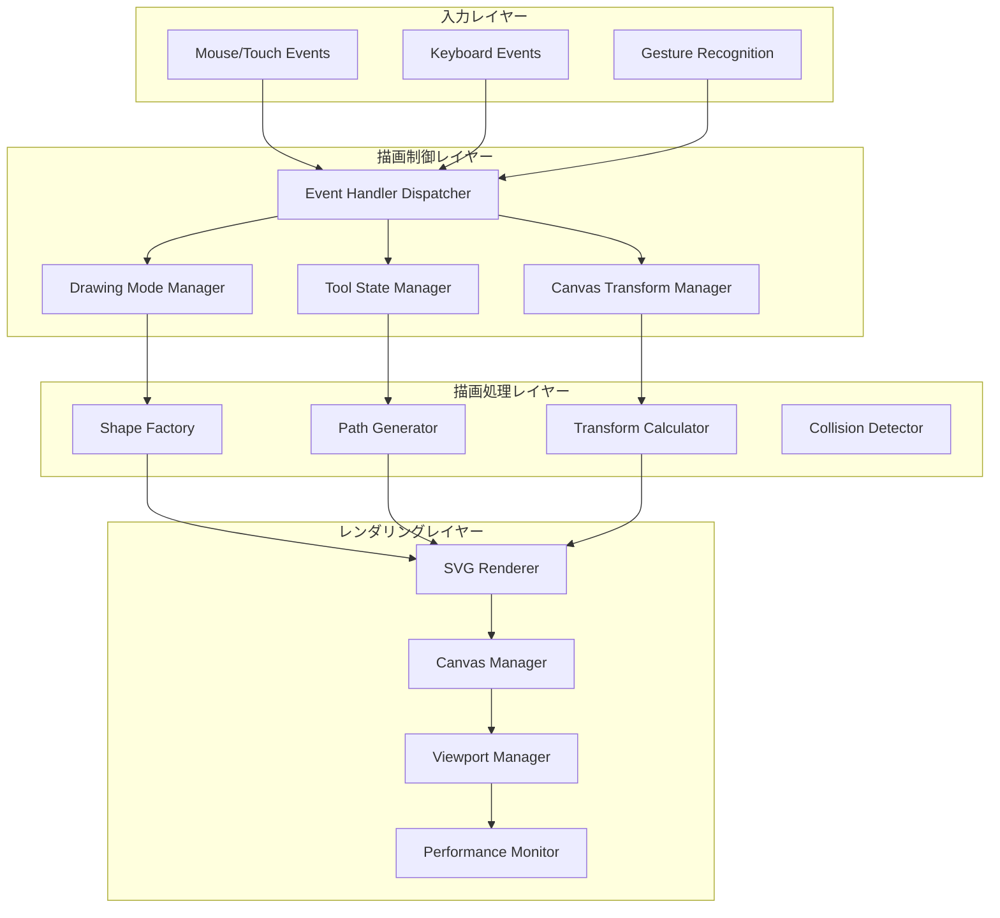
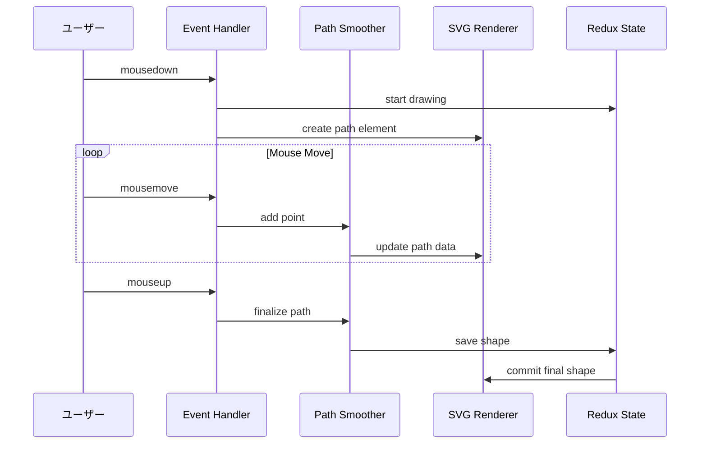
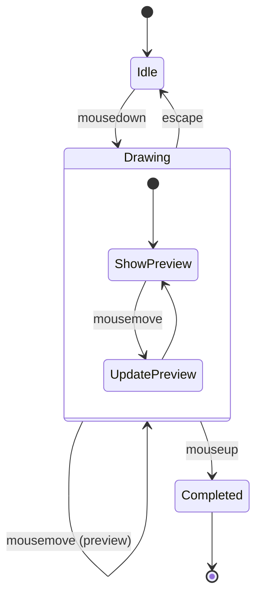
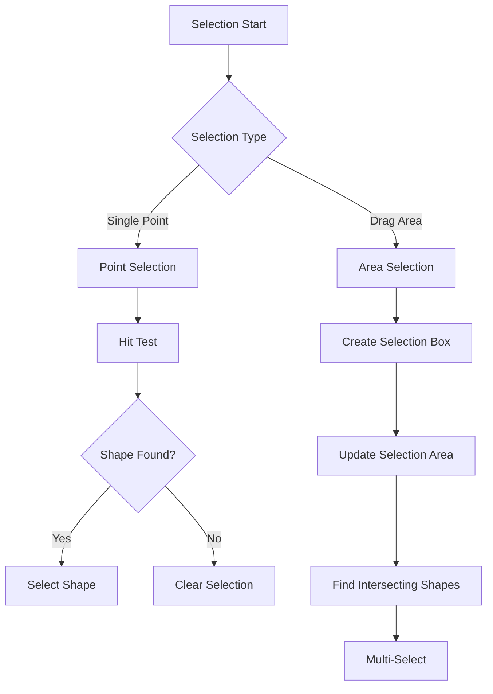
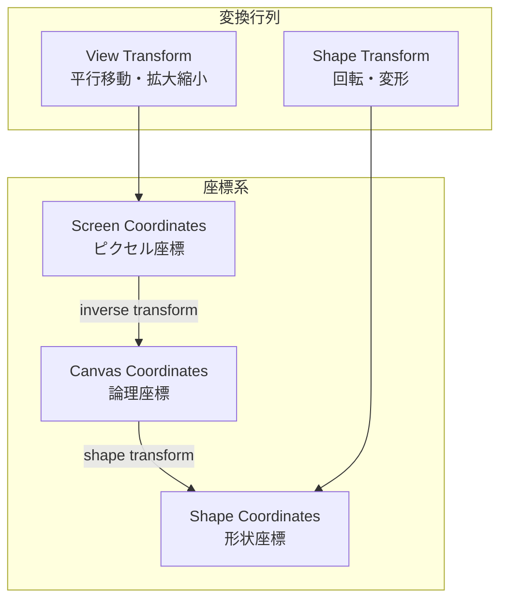
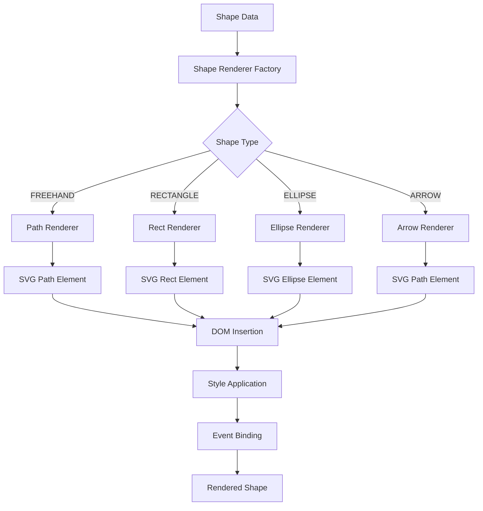
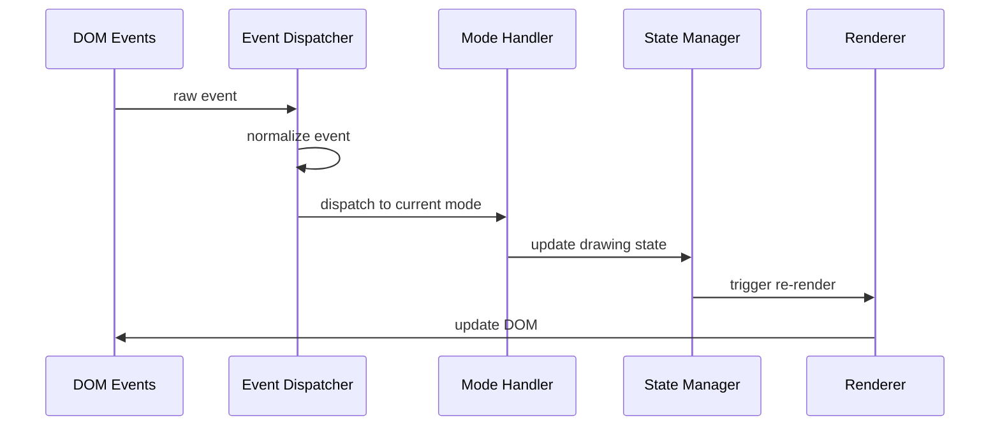

# 描画エンジンアーキテクチャ

## 概要

Pointlessアプリケーションの描画エンジンは、SVGベースの無限キャンバスシステムです。リアルタイムな描画体験、効率的なレンダリング、複数の描画モードをサポートする高性能なアーキテクチャを提供します。

## アーキテクチャ概要

### 描画システム全体構成



## 描画モード別アーキテクチャ

### 1. フリーハンド描画モード



#### パス平滑化アルゴリズム

```typescript
interface PathSmoother {
  addPoint(point: Point): void;
  getSmoothPath(): string;
  finalize(): Point[];
}

class BezierPathSmoother implements PathSmoother {
  private points: Point[] = [];
  private smoothingFactor: number = 0.3;
  
  addPoint(point: Point): void {
    this.points.push(point);
    
    if (this.points.length > 2) {
      this.updateSmoothPath();
    }
  }
  
  private updateSmoothPath(): void {
    const path = this.generateBezierPath();
    this.updateSVGPath(path);
  }
  
  private generateBezierPath(): string {
    // Catmull-Rom スプライン補間による平滑化
    return getSmoothPath(this.points, this.smoothingFactor);
  }
}
```

### 2. 図形描画モード（矩形・楕円・矢印）



#### 図形プレビューシステム

```typescript
class ShapePreviewManager {
  private previewElement: SVGElement | null = null;
  private startPoint: Point | null = null;
  
  startPreview(point: Point, shapeType: ShapeType): void {
    this.startPoint = point;
    this.previewElement = this.createPreviewElement(shapeType);
    this.addToCanvas(this.previewElement);
  }
  
  updatePreview(currentPoint: Point, preserveAspectRatio: boolean): void {
    if (!this.previewElement || !this.startPoint) return;
    
    const bounds = this.calculateBounds(
      this.startPoint, 
      currentPoint, 
      preserveAspectRatio
    );
    
    this.updateElementBounds(this.previewElement, bounds);
  }
  
  commitPreview(): Shape {
    const shape = this.convertToShape(this.previewElement);
    this.removePreview();
    return shape;
  }
}
```

### 3. 選択モード



#### 衝突検出システム

```typescript
class CollisionDetector {
  private spatialIndex: QuadTree;
  
  constructor(canvasBounds: Rectangle) {
    this.spatialIndex = new QuadTree(canvasBounds);
  }
  
  findShapesInArea(area: Rectangle): Shape[] {
    const candidates = this.spatialIndex.query(area);
    return candidates.filter(shape => 
      this.testShapeIntersection(shape, area)
    );
  }
  
  findShapeAtPoint(point: Point): Shape | null {
    const candidates = this.spatialIndex.query(
      Rectangle.fromPoint(point, 1)
    );
    
    for (const shape of candidates) {
      if (this.testPointInShape(point, shape)) {
        return shape;
      }
    }
    
    return null;
  }
  
  private testPointInShape(point: Point, shape: Shape): boolean {
    switch (shape.type) {
      case 'FREEHAND':
        return this.testPointInPath(point, shape.points);
      case 'RECTANGLE':
        return this.testPointInRectangle(point, shape);
      case 'ELLIPSE':
        return this.testPointInEllipse(point, shape);
      default:
        return false;
    }
  }
}
```

## キャンバス変換システム

### 座標変換アーキテクチャ



### 変換マネージャー

```typescript
class CanvasTransformManager {
  private transform: DOMMatrix;
  private viewBox: Rectangle;
  private scale: number = 1;
  private translation: Point = { x: 0, y: 0 };
  
  // スクリーン座標をキャンバス座標に変換
  screenToCanvas(screenPoint: Point): Point {
    const inverse = this.transform.inverse();
    return {
      x: screenPoint.x * inverse.a + screenPoint.y * inverse.c + inverse.e,
      y: screenPoint.x * inverse.b + screenPoint.y * inverse.d + inverse.f
    };
  }
  
  // キャンバス座標をスクリーン座標に変換
  canvasToScreen(canvasPoint: Point): Point {
    return {
      x: canvasPoint.x * this.transform.a + canvasPoint.y * this.transform.c + this.transform.e,
      y: canvasPoint.x * this.transform.b + canvasPoint.y * this.transform.d + this.transform.f
    };
  }
  
  // ズーム操作
  zoom(factor: number, center: Point): void {
    const newScale = Math.max(MIN_SCALE, Math.min(MAX_SCALE, this.scale * factor));
    
    if (newScale !== this.scale) {
      // ズーム中心点を維持
      const canvasCenter = this.screenToCanvas(center);
      this.scale = newScale;
      this.updateTransform();
      
      // 中心点がずれないように平行移動を調整
      const newScreenCenter = this.canvasToScreen(canvasCenter);
      this.translate({
        x: center.x - newScreenCenter.x,
        y: center.y - newScreenCenter.y
      });
    }
  }
  
  // パン操作
  pan(delta: Point): void {
    this.translation.x += delta.x / this.scale;
    this.translation.y += delta.y / this.scale;
    this.updateTransform();
  }
}
```

## SVGレンダリングシステム

### レンダリングパイプライン



### Shape Renderer実装

```typescript
abstract class ShapeRenderer {
  abstract render(shape: Shape): SVGElement;
  abstract updateStyle(element: SVGElement, shape: Shape): void;
}

class FreehandRenderer extends ShapeRenderer {
  render(shape: Shape): SVGPathElement {
    const path = document.createElementNS('http://www.w3.org/2000/svg', 'path');
    const pathData = getSmoothPath(shape.points);
    
    path.setAttribute('d', pathData);
    path.setAttribute('fill', 'none');
    path.setAttribute('stroke', shape.color);
    path.setAttribute('stroke-width', shape.linewidth.toString());
    path.setAttribute('stroke-linecap', 'round');
    path.setAttribute('stroke-linejoin', 'round');
    
    return path;
  }
  
  updateStyle(element: SVGPathElement, shape: Shape): void {
    element.setAttribute('stroke', shape.color);
    element.setAttribute('stroke-width', shape.linewidth.toString());
  }
}

class RectangleRenderer extends ShapeRenderer {
  render(shape: Shape): SVGRectElement {
    const rect = document.createElementNS('http://www.w3.org/2000/svg', 'rect');
    const bounds = this.calculateBounds(shape);
    
    rect.setAttribute('x', bounds.x.toString());
    rect.setAttribute('y', bounds.y.toString());
    rect.setAttribute('width', bounds.width.toString());
    rect.setAttribute('height', bounds.height.toString());
    this.updateStyle(rect, shape);
    
    return rect;
  }
}
```

## パフォーマンス最適化

### 1. 仮想化とカリング

```typescript
class ViewportCuller {
  private viewport: Rectangle;
  private visibleShapes: Set<string> = new Set();
  
  updateViewport(viewport: Rectangle): void {
    this.viewport = viewport;
    this.cullShapes();
  }
  
  private cullShapes(): void {
    const allShapes = this.getShapesInBounds(this.viewport);
    
    // 新しく表示対象になったシェイプ
    const newlyVisible = allShapes.filter(shape => 
      !this.visibleShapes.has(shape.id)
    );
    
    // 非表示になったシェイプ
    const hiddenShapes = Array.from(this.visibleShapes).filter(id => 
      !allShapes.some(shape => shape.id === id)
    );
    
    // DOM操作
    newlyVisible.forEach(shape => this.renderShape(shape));
    hiddenShapes.forEach(id => this.removeShape(id));
    
    this.visibleShapes = new Set(allShapes.map(s => s.id));
  }
}
```

### 2. 描画の最適化

```typescript
class DrawingOptimizer {
  private frameId: number | null = null;
  private pendingUpdates: Map<string, Shape> = new Map();
  
  scheduleUpdate(shape: Shape): void {
    this.pendingUpdates.set(shape.id, shape);
    
    if (!this.frameId) {
      this.frameId = requestAnimationFrame(() => {
        this.flushUpdates();
      });
    }
  }
  
  private flushUpdates(): void {
    // バッチでDOM更新
    this.pendingUpdates.forEach((shape, id) => {
      this.updateShapeElement(id, shape);
    });
    
    this.pendingUpdates.clear();
    this.frameId = null;
  }
}
```

### 3. メモリ管理

```typescript
class ShapeElementPool {
  private pools: Map<ShapeType, SVGElement[]> = new Map();
  
  acquire(shapeType: ShapeType): SVGElement {
    const pool = this.pools.get(shapeType) || [];
    
    if (pool.length > 0) {
      return pool.pop()!;
    }
    
    return this.createElement(shapeType);
  }
  
  release(element: SVGElement, shapeType: ShapeType): void {
    // 要素をリセット
    this.resetElement(element);
    
    // プールに戻す
    const pool = this.pools.get(shapeType) || [];
    pool.push(element);
    this.pools.set(shapeType, pool);
  }
}
```

## イベント処理アーキテクチャ

### イベントディスパッチャー



### 統一イベントハンドリング

```typescript
class DrawingEventDispatcher {
  private currentMode: DrawingMode;
  private handlers: Map<DrawingMode, ModeHandler>;
  
  constructor() {
    this.handlers = new Map([
      [DrawingMode.FREEHAND, new FreehandHandler()],
      [DrawingMode.RECTANGLE, new RectangleHandler()],
      [DrawingMode.SELECT, new SelectionHandler()],
    ]);
  }
  
  handlePointerDown(event: PointerEvent): void {
    const normalizedEvent = this.normalizeEvent(event);
    const handler = this.handlers.get(this.currentMode);
    handler?.onPointerDown(normalizedEvent);
  }
  
  private normalizeEvent(event: PointerEvent): NormalizedPointerEvent {
    return {
      point: this.transformCoordinates(event.clientX, event.clientY),
      pressure: event.pressure,
      shiftKey: event.shiftKey,
      ctrlKey: event.ctrlKey || event.metaKey,
      timestamp: event.timeStamp,
    };
  }
}
```

この描画エンジンアーキテクチャにより、Pointlessアプリケーションは高性能で柔軟な描画体験を提供します。