# 全体アーキテクチャ設計書

## 概要

Pointlessアプリケーションの全体的なソフトウェアアーキテクチャを定義します。React + Tauri構成によるデスクトップアプリケーションとして、フロントエンド、バックエンド、ローカルストレージの3層構造で設計されています。

## システム全体構成

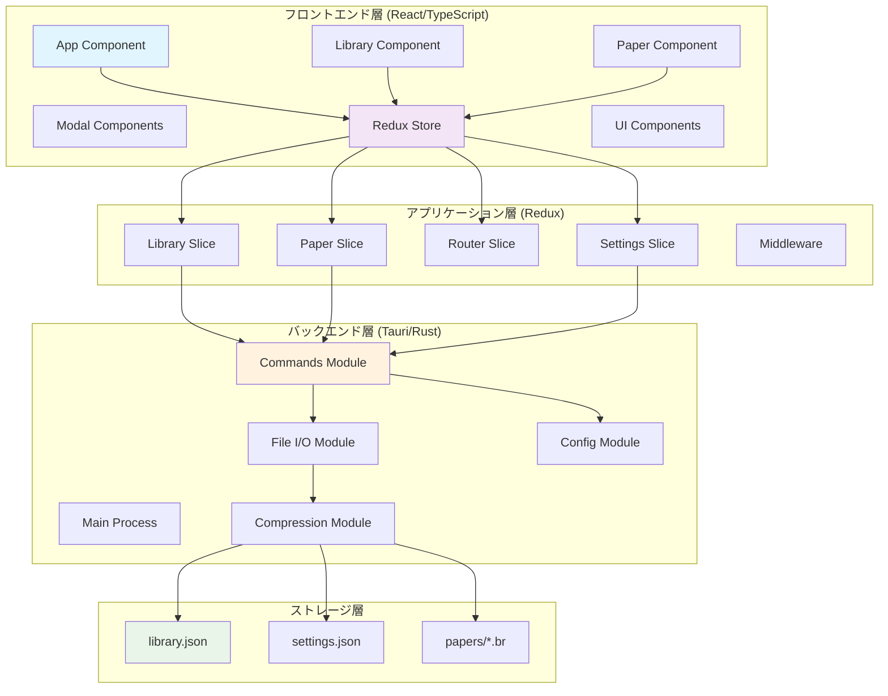

## レイヤー別アーキテクチャ

### プレゼンテーション層（React Components）

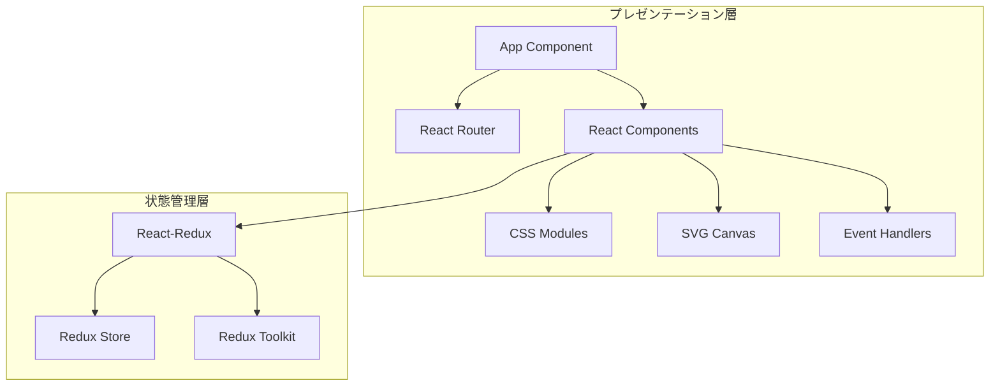

#### 責務
- **UI表示**: コンポーネントベースのユーザーインターフェース
- **ユーザー操作**: イベントハンドリングとユーザーアクション
- **状態購読**: Redux storeからの状態変更の購読
- **レンダリング**: 効率的なDOM更新とSVG描画

### アプリケーション層（Redux State Management）

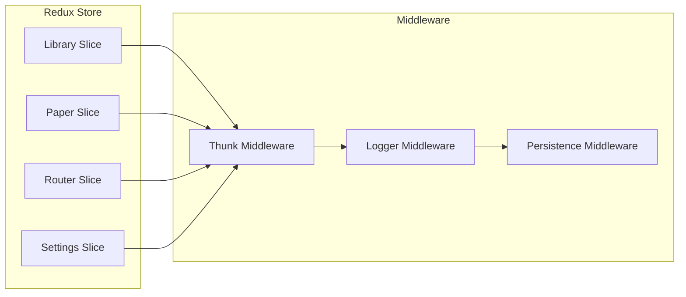

#### 責務
- **状態管理**: アプリケーション全体の状態の一元管理
- **ビジネスロジック**: データ変換とビジネスルール
- **非同期処理**: API呼び出しと副作用の管理
- **永続化**: 状態の保存と復元

### ドメイン層（Business Logic）

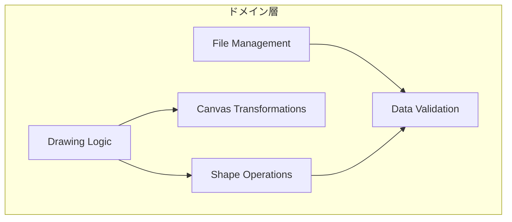

#### 責務
- **描画ロジック**: SVGベースの描画処理
- **ファイル管理**: フォルダ・ペーパーの操作
- **データ変換**: モデル間の変換処理
- **バリデーション**: データ整合性の検証

### インフラストラクチャ層（Tauri Backend）

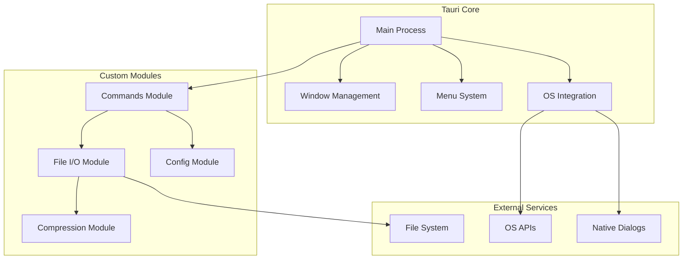

#### 責務
- **システム統合**: OS固有の機能へのアクセス
- **ファイルI/O**: ローカルファイルシステムとの連携
- **セキュリティ**: サンドボックス環境での安全な操作
- **パフォーマンス**: ネイティブレベルの処理性能

## アーキテクチャパターン

### 1. MVC（Model-View-Controller）パターン

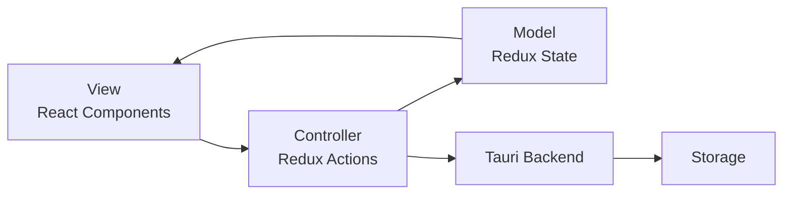

### 2. レイヤードアーキテクチャ

| レイヤー | 技術 | 責務 |
|---------|------|------|
| プレゼンテーション | React/TypeScript | UI表示、ユーザー操作 |
| アプリケーション | Redux Toolkit | 状態管理、ビジネスロジック |
| ドメイン | TypeScript | コアロジック、データモデル |
| インフラストラクチャ | Tauri/Rust | システム統合、永続化 |

### 3. イベント駆動アーキテクチャ

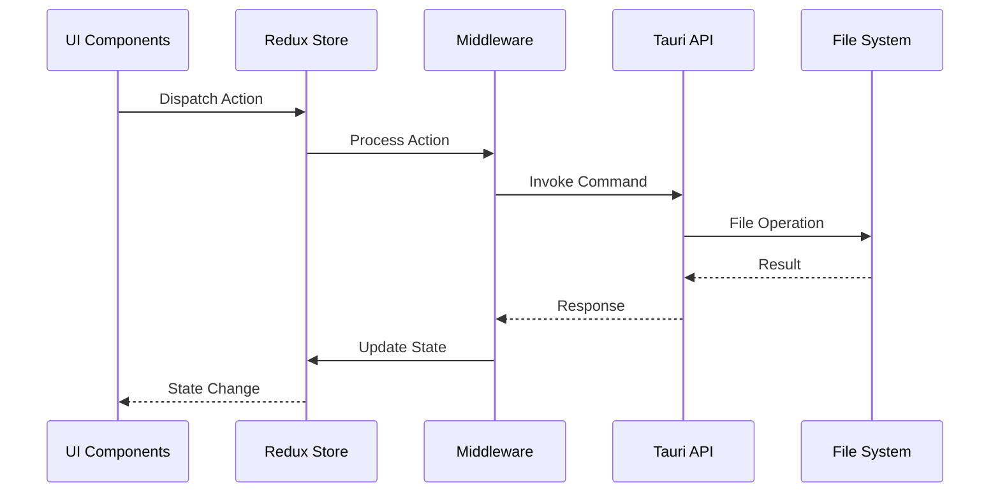

## コンポーネント間通信

### 1. フロントエンド内通信

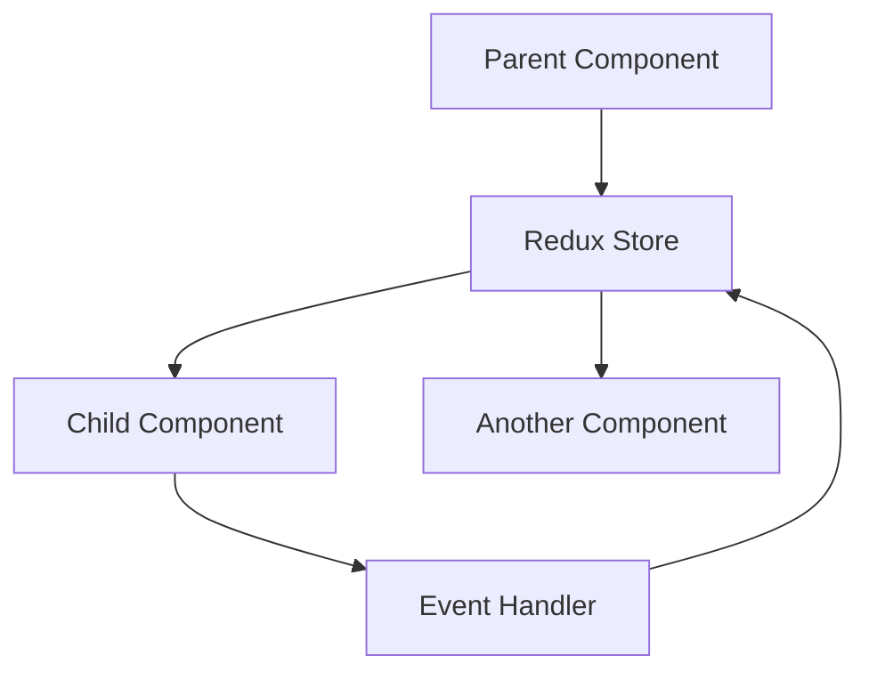

- **Redux**: 状態の一元管理による間接通信
- **Props**: 親子コンポーネント間の直接通信
- **Context**: 深いコンポーネント階層での状態共有

### 2. フロントエンド ↔ バックエンド通信

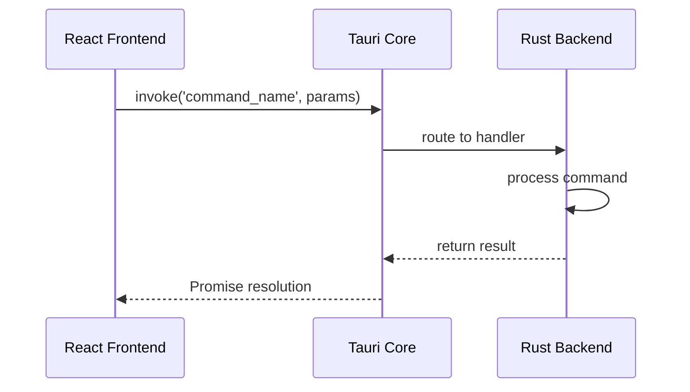

### 3. データフロー

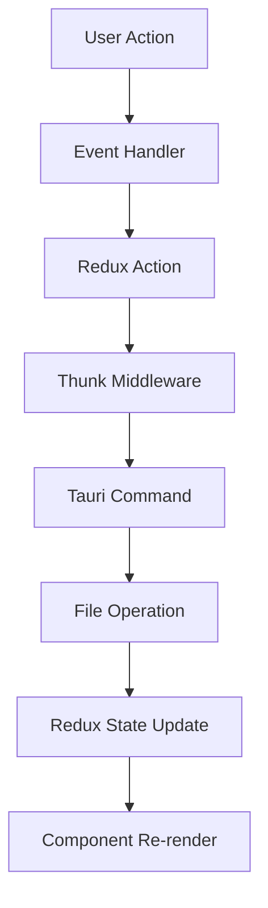

## セキュリティアーキテクチャ

### 1. サンドボックス環境

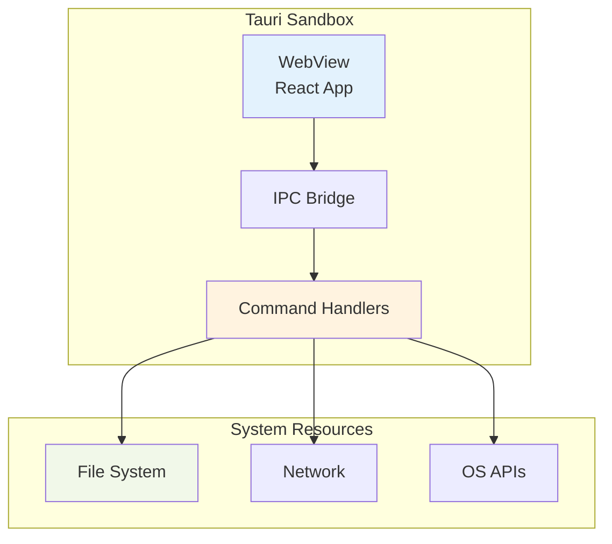

### 2. 権限モデル

| リソース | アクセス権 | 制約 |
|---------|-----------|------|
| ローカルファイル | 読み書き | アプリデータディレクトリのみ |
| ネットワーク | なし | オフラインアプリ |
| システムAPI | 制限付き | ダイアログ、ウィンドウ管理のみ |

## パフォーマンスアーキテクチャ

### 1. レンダリング最適化

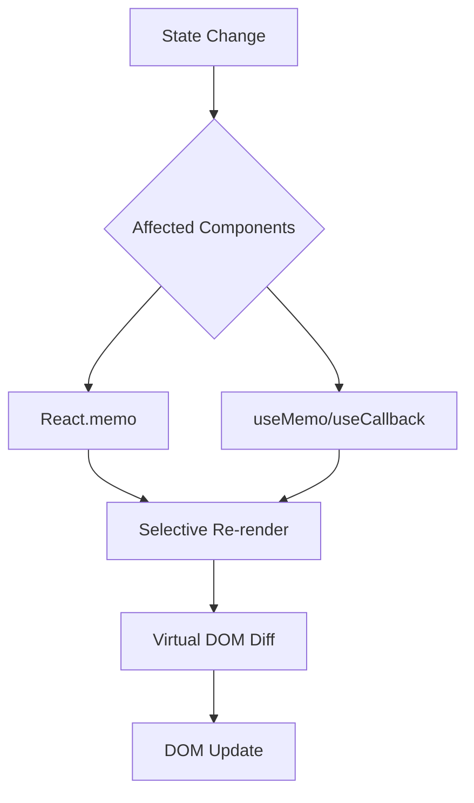

### 2. データ最適化

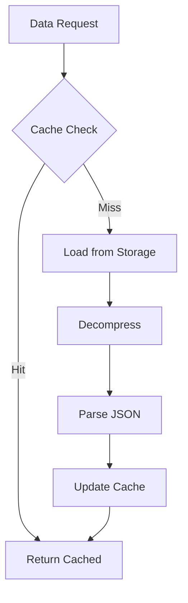

### 3. 非同期処理

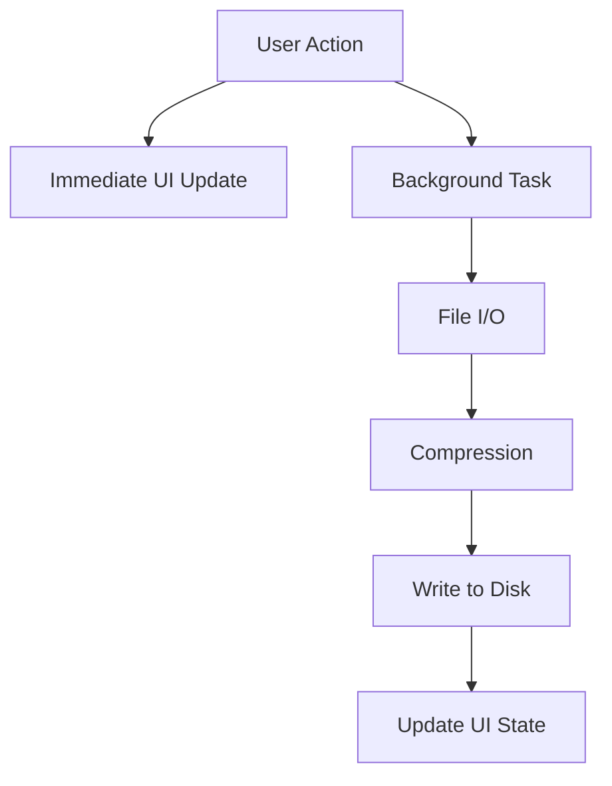

## 拡張性設計

### 1. プラグインアーキテクチャ

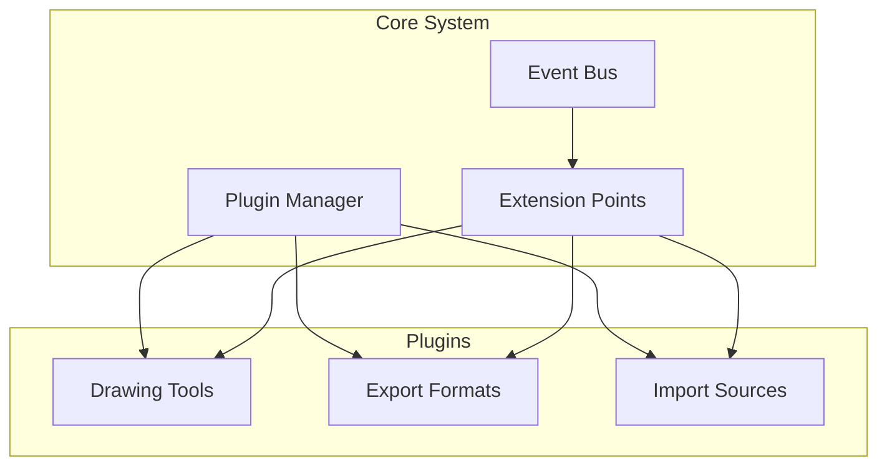

### 2. モジュラー設計

```typescript
// モジュール定義例
interface DrawingTool {
  name: string;
  icon: string;
  onStart: (point: Point) => void;
  onDrag: (point: Point) => void;
  onEnd: (point: Point) => Shape;
}

interface ExportFormat {
  name: string;
  extension: string;
  export: (shapes: Shape[]) => Promise<Blob>;
}
```

## 障害対応アーキテクチャ

### 1. エラーハンドリング階層

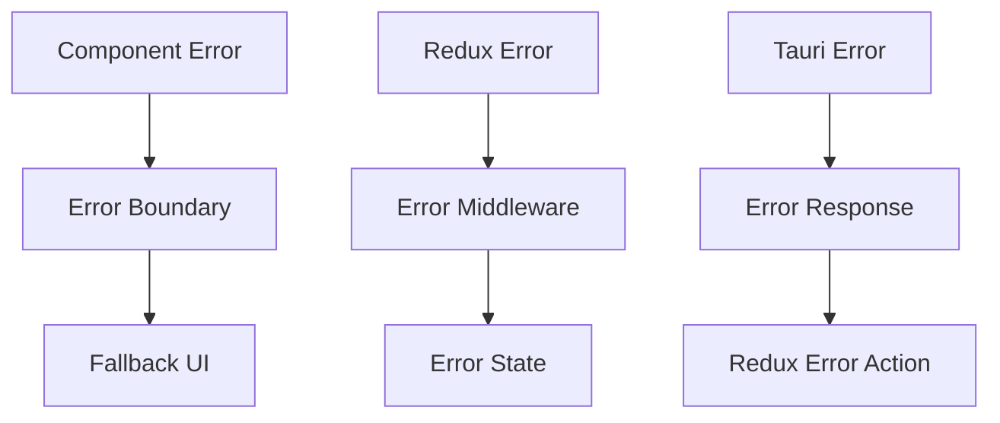

### 2. データ復旧メカニズム

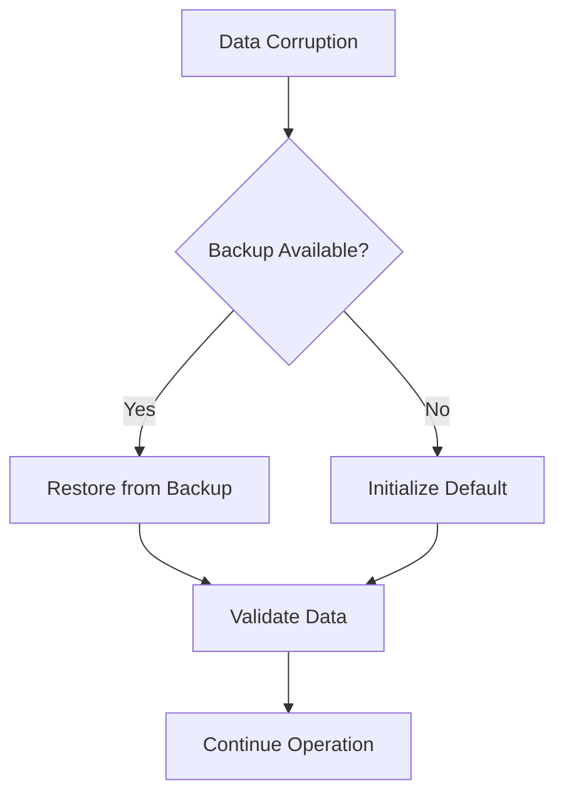

このアーキテクチャにより、Pointlessアプリケーションは拡張性、保守性、パフォーマンスを兼ね備えた堅牢なシステムとして設計されています。