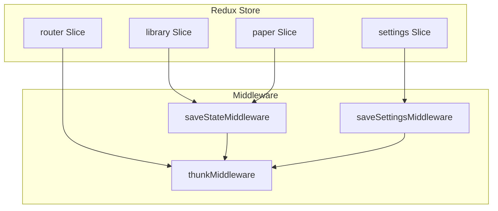
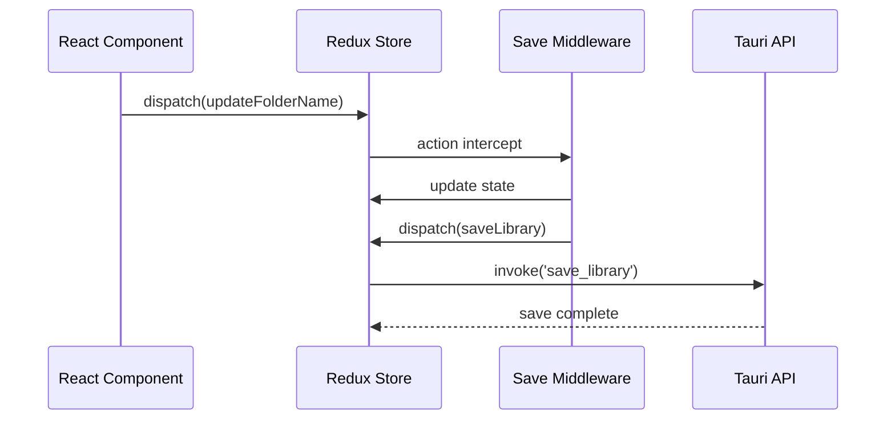
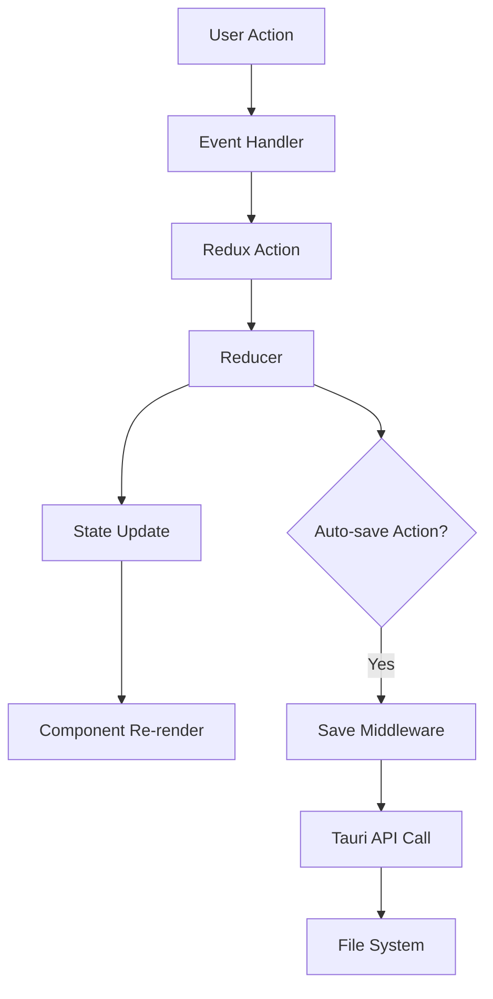
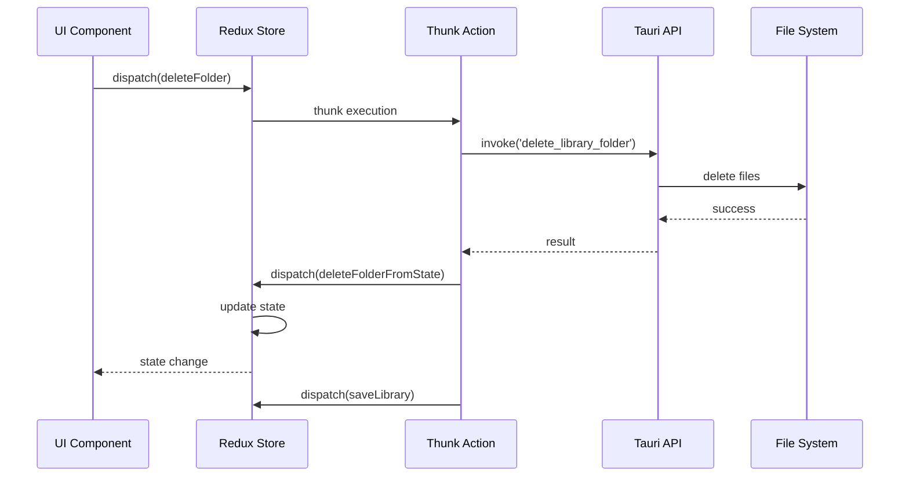

# Redux状態管理アーキテクチャ

## 概要

Pointlessアプリケーションは Redux Toolkit を使用した状態管理アーキテクチャを採用しています。アプリケーションの全状態を一元管理し、予測可能な状態更新とデバッグを実現します。

## Store構成

### Store全体構造



### State Tree構造

```typescript
interface RootState {
  library: LibraryState;
  paper: PaperState;
  router: RouterState;
  settings: SettingsState;
}
```

## Slice詳細仕様

### 1. Library Slice

#### State構造

```typescript
interface LibraryState {
  folders: Folder[];
  papers: Paper[];
}
```

#### Actions

| Action | 説明 | ペイロード | 副作用 |
|--------|------|-----------|--------|
| `newFolder` | 新規フォルダ作成 | なし | UUID生成、タイムスタンプ設定 |
| `newPaperInFolder` | 新規ペーパー作成 | `folderId: string` | UUID生成、空shapes配列 |
| `updateFolderName` | フォルダ名更新 | `{id: string, name: string}` | updatedAt更新 |
| `updatePaperName` | ペーパー名更新 | `{id: string, name: string}` | updatedAt更新 |
| `setPaperShapes` | 描画データ更新 | `{id: string, shapes: Shape[]}` | updatedAt更新 |
| `deleteFolderFromState` | フォルダ削除 | `folderId: string` | 関連ペーパーも削除 |
| `deletePaperFromState` | ペーパー削除 | `paperId: string` | - |
| `loadFolders` | フォルダ一覧読み込み | `Folder[]` | 起動時初期化 |
| `loadPapers` | ペーパー一覧読み込み | `Paper[]` | 起動時初期化 |
| `saveLibrary` | ライブラリ保存 | なし | Tauri API呼び出し |

#### Thunk Actions

```typescript
// 非同期削除処理
export const deleteFolder = (folderId: string) => async (dispatch, getState) => {
  try {
    // Tauri APIでファイルシステムから削除
    await invoke('delete_library_folder', { folderId });
    
    // Stateから削除
    dispatch(deleteFolderFromState(folderId));
    
    // 自動保存
    dispatch(saveLibrary());
  } catch (error) {
    console.error('Failed to delete folder:', error);
  }
};
```

### 2. Paper Slice

#### State構造

```typescript
interface PaperState {
  paperId: string | null;  // 現在開いているペーパーID
}
```

#### Actions

| Action | 説明 | ペイロード |
|--------|------|-----------|
| `setCurrentPaper` | 現在のペーパー設定 | `paperId: string` |
| `clearCurrentPaper` | ペーパー選択解除 | なし |

### 3. Router Slice

#### State構造

```typescript
interface RouterState {
  current: 'library' | 'paper';
  args?: {
    paperId?: string;
  };
}
```

#### Actions

| Action | 説明 | ペイロード |
|--------|------|-----------|
| `to` | 画面遷移 | `{name: string, args?: object}` |

### 4. Settings Slice

#### State構造

```typescript
interface SettingsState {
  isDarkMode: boolean;
  platform: string;
  appVersion: string;
  sortPapersBy: number;
  viewMode: number;
  canvasPreferredLinewidth: number;
  linewidthSliderMode: boolean;    // 新規追加: スライダーモード状態
}
```

#### Actions

| Action | 説明 | ペイロード | 自動保存 |
|--------|------|-----------|----------|
| `setDarkMode` | テーマ設定 | `boolean` | ✓ |
| `setSortPapersBy` | ソート順設定 | `number` | ✓ |
| `setViewMode` | 表示モード設定 | `number` | ✓ |
| `setPreferredLinewidth` | デフォルト線幅（拡張範囲対応） | `number` | ✓ |
| `setLinewidthSliderMode` | スライダーモード切り替え | `boolean` | ✓ |
| `loadSettings` | 設定読み込み（範囲検証付き） | `SettingsState` | - |
| `saveSettings` | 設定保存 | なし | - |

#### 線幅設定の拡張仕様

```typescript
// 従来のプリセット値（後方互換性維持）
const LINEWIDTH = {
  SMALL: 2,
  MEDIUM: 5, 
  LARGE: 8,
};

// 新しいスライダー設定範囲
const LINEWIDTH_SLIDER = {
  MIN: 1,      // 最小値
  MAX: 20,     // 最大値
  STEP: 1,     // ステップ値
  DEFAULT: 2,  // デフォルト値
};
```

#### バリデーション機能

```typescript
// setPreferredLinewidth アクションでの自動検証
const setPreferredLinewidth = (state, action) => {
  const value = Number(action.payload);
  
  // 型と範囲の検証
  if (isNaN(value) || !isFinite(value)) {
    console.warn(`Invalid linewidth: ${action.payload}`);
    state.canvasPreferredLinewidth = LINEWIDTH_SLIDER.DEFAULT;
    return;
  }
  
  // 値のクランプと丸め
  const clampedValue = Math.max(
    LINEWIDTH_SLIDER.MIN,
    Math.min(LINEWIDTH_SLIDER.MAX, Math.round(value))
  );
  
  state.canvasPreferredLinewidth = clampedValue;
};
```

## Middleware詳細

### 1. Save State Middleware

```typescript
const saveStateMiddleware = (store) => (next) => (action) => {
  const result = next(action);

  if (typeof action === 'object') {
    const reducerName = action.type.split('/')[0];
    const actionName = action.type.split('/')[1];

    // ライブラリデータの自動保存
    const whitelistedActions = [
      'updateFolderName',
      'updatePaperName', 
      'deleteFolder',
      'deletePaper',
    ];

    if (reducerName === 'library' && whitelistedActions.includes(actionName)) {
      store.dispatch(saveLibrary());
    }
  }

  return result;
};
```

#### 動作フロー



### 2. Save Settings Middleware

```typescript
const saveSettingsMiddleware = (store) => (next) => (action) => {
  const result = next(action);

  if (typeof action === 'object') {
    const reducerName = action.type.split('/')[0];
    const actionName = action.type.split('/')[1];

    const whitelistedActions = [
      'setSortPapersBy', 
      'setViewMode', 
      'setPreferredLinewidth',
      'setLinewidthSliderMode'    // 新規追加
    ];

    if (reducerName === 'settings' && whitelistedActions.includes(actionName)) {
      store.dispatch(saveSettings());
    }
  }

  return result;
};
```

## データフロー図

### 通常の状態更新フロー



### 非同期操作フロー



## 状態の正規化

### Papers-Folders関係の管理

```typescript
// Selectors for normalized data access
const selectFolderById = (state: RootState, folderId: string) =>
  state.library.folders.find(folder => folder.id === folderId);

const selectPapersByFolder = (state: RootState, folderId: string) =>
  state.library.papers.filter(paper => paper.folderId === folderId);

const selectCurrentPaper = (state: RootState) => {
  if (!state.paper.paperId) return null;
  return state.library.papers.find(paper => paper.id === state.paper.paperId);
};
```

### Memoized Selectors

```typescript
import { createSelector } from '@reduxjs/toolkit';

const selectLibrary = (state: RootState) => state.library;
const selectSettings = (state: RootState) => state.settings;

export const selectSortedPapers = createSelector(
  [selectLibrary, selectSettings],
  (library, settings) => {
    const { papers } = library;
    const { sortPapersBy } = settings;
    
    return [...papers].sort((a, b) => {
      switch (sortPapersBy) {
        case SortBy.NAME_AZ:
          return a.name.localeCompare(b.name);
        case SortBy.LAST_MODIFIED_DESC:
          return new Date(b.updatedAt).getTime() - new Date(a.updatedAt).getTime();
        default:
          return 0;
      }
    });
  }
);
```

## エラーハンドリング

### Error State管理

```typescript
interface AsyncState<T> {
  data: T | null;
  loading: boolean;
  error: string | null;
}

// Enhanced Library State
interface LibraryState {
  folders: Folder[];
  papers: Paper[];
  saveState: AsyncState<void>;
  loadState: AsyncState<void>;
}
```

### Error Actions

```typescript
const librarySlice = createSlice({
  name: 'library',
  initialState,
  reducers: {
    // ... other reducers
    setSaveLoading: (state, action) => {
      state.saveState.loading = action.payload;
    },
    setSaveError: (state, action) => {
      state.saveState.error = action.payload;
      state.saveState.loading = false;
    },
    clearSaveError: (state) => {
      state.saveState.error = null;
    },
  },
});
```

## パフォーマンス最適化

### 1. Action Batching

```typescript
// 複数の関連アクションをバッチ処理
export const updatePaperBatch = (updates: PaperUpdate[]) => (dispatch) => {
  // React will batch these updates automatically
  updates.forEach(update => {
    dispatch(updatePaperName(update));
  });
  
  // Single save call
  dispatch(saveLibrary());
};
```

### 2. Selective State Updates

```typescript
// Immer利用で部分更新の最適化
const updatePaperShapes = (state, action) => {
  const { id, shapes } = action.payload;
  const paper = state.papers.find(p => p.id === id);
  
  if (paper) {
    paper.shapes = shapes;  // Immerが自動で不変更新
    paper.updatedAt = new Date().toISOString();
  }
};
```

### 3. Middleware最適化

```typescript
// デバウンス処理でファイル保存を最適化
const debouncedSaveMiddleware = (store) => {
  let saveTimeout = null;
  
  return (next) => (action) => {
    const result = next(action);
    
    if (shouldAutoSave(action)) {
      clearTimeout(saveTimeout);
      saveTimeout = setTimeout(() => {
        store.dispatch(saveLibrary());
      }, 1000); // 1秒後に保存
    }
    
    return result;
  };
};
```

## デバッグとテスト

### Redux DevTools統合

```typescript
const store = configureStore({
  reducer: rootReducer,
  middleware: [/* middlewares */],
  devTools: process.env.NODE_ENV !== 'production',
});
```

### テスト用Mock Store

```typescript
import { configureStore } from '@reduxjs/toolkit';

export const createMockStore = (initialState = {}) => {
  return configureStore({
    reducer: rootReducer,
    preloadedState: initialState,
    middleware: [], // テスト時はmiddlewareなし
  });
};
```

このRedux状態管理アーキテクチャにより、Pointlessアプリケーションは予測可能で保守しやすい状態管理を実現しています。