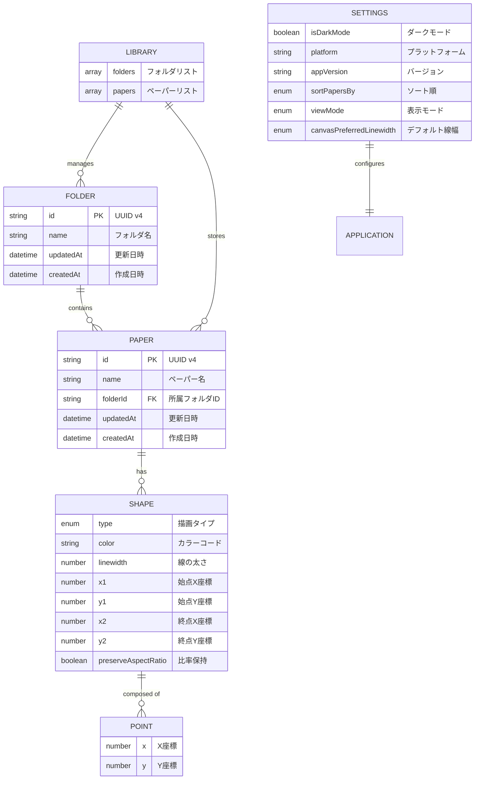
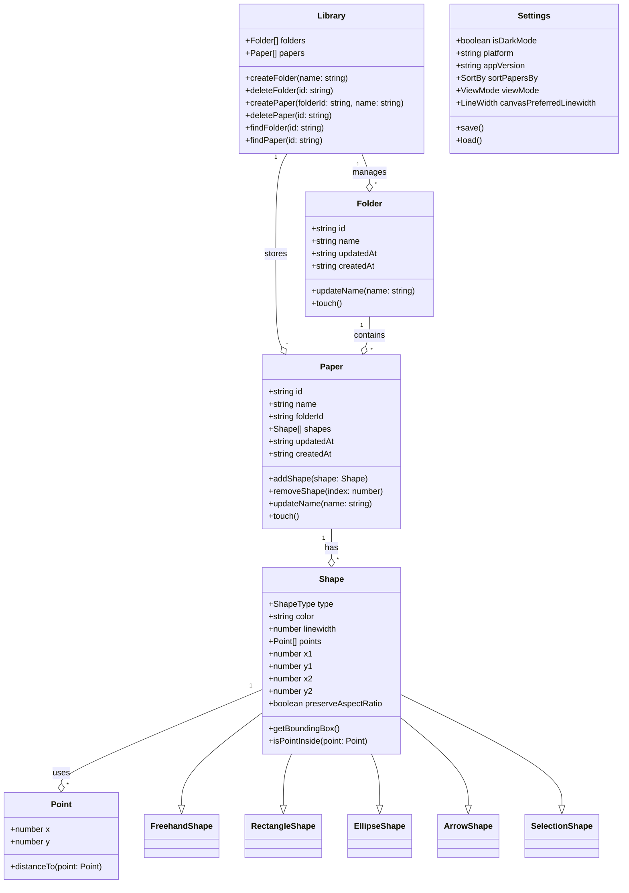

# データ関係性図

## 概要

Pointlessアプリケーションにおけるデータモデル間の関係性を定義します。エンティティ関係図（ER図）とクラス図を用いて、データの構造と相互依存関係を明確化します。

## エンティティ関係図（ER図）

### 基本的なデータ関係



## クラス図

### データモデルの構造関係



## データ関係の詳細

### 1. Library ↔ Folder/Paper

| 関係 | 説明 | カーディナリティ |
|------|------|-----------------|
| Library → Folder | ライブラリは複数のフォルダを管理 | 1:N |
| Library → Paper | ライブラリは全ペーパーの参照を保持 | 1:N |
| 整合性 | フォルダ/ペーパーの追加・削除時に同期 | - |

### 2. Folder ↔ Paper

| 関係 | 説明 | カーディナリティ |
|------|------|-----------------|
| Folder → Paper | 1つのフォルダは複数のペーパーを含む | 1:N |
| Paper → Folder | 各ペーパーは1つのフォルダに所属 | N:1 |
| 参照整合性 | Paper.folderIdは必ず存在するFolder.idを参照 | - |
| カスケード削除 | フォルダ削除時、所属ペーパーも削除 | - |

### 3. Paper ↔ Shape

| 関係 | 説明 | カーディナリティ |
|------|------|-----------------|
| Paper → Shape | 1つのペーパーは複数のシェイプを含む | 1:N |
| 所有関係 | シェイプはペーパーに完全に所有される | Composition |
| 順序性 | shapes配列の順序が描画順序を決定 | - |

### 4. Shape ↔ Point

| 関係 | 説明 | カーディナリティ |
|------|------|-----------------|
| Shape → Point | フリーハンドシェイプは複数の点を持つ | 1:N |
| 条件付き関係 | type='FREEHAND'の場合のみpoints配列を使用 | - |
| その他のシェイプ | x1,y1,x2,y2の座標ペアを使用 | - |

## データフロー図

### 読み込みフロー

```mermaid
graph TD
    Start[アプリ起動] --> LoadSettings[settings.json読み込み]
    LoadSettings --> LoadLibrary[library.json読み込み]
    LoadLibrary --> ParseMetadata[メタデータパース]
    
    ParseMetadata --> LoadPapers{ペーパーデータ読み込み}
    LoadPapers --> LoadPaperFile[papers/{id}.br読み込み]
    LoadPaperFile --> Decompress[Brotli解凍]
    Decompress --> ParsePaper[ペーパーデータパース]
    ParsePaper --> StoreInMemory[メモリに格納]
    
    StoreInMemory --> MorePapers{他のペーパーあり？}
    MorePapers -->|Yes| LoadPaperFile
    MorePapers -->|No| Ready[準備完了]
```

### 保存フロー

```mermaid
graph TD
    Change[データ変更] --> CheckType{変更タイプ}
    
    CheckType -->|メタデータ| SaveMetadata[library.json更新]
    CheckType -->|描画データ| SavePaper[ペーパー保存]
    CheckType -->|設定| SaveSettings[settings.json更新]
    
    SavePaper --> Compress[Brotli圧縮]
    Compress --> WritePaperFile[papers/{id}.br書き込み]
    WritePaperFile --> UpdateMetadata[メタデータ更新]
    UpdateMetadata --> SaveMetadata
```

## データ整合性ルール

### 1. 参照整合性

```typescript
// Paper作成時の検証
function createPaper(folderId: string, name: string): Paper {
  const folder = library.findFolder(folderId);
  if (!folder) {
    throw new Error('Invalid folder ID');
  }
  // ... ペーパー作成処理
}
```

### 2. カスケード削除

```typescript
// フォルダ削除時の処理
function deleteFolder(folderId: string): void {
  // 所属するペーパーを先に削除
  const papers = library.papers.filter(p => p.folderId === folderId);
  papers.forEach(paper => deletePaper(paper.id));
  
  // フォルダを削除
  library.folders = library.folders.filter(f => f.id !== folderId);
}
```

### 3. 孤立データの防止

```typescript
// アプリ起動時の整合性チェック
function validateLibrary(): void {
  const validFolderIds = new Set(library.folders.map(f => f.id));
  
  // 無効なfolderIdを持つペーパーを削除
  library.papers = library.papers.filter(paper => {
    if (!validFolderIds.has(paper.folderId)) {
      console.warn(`Removing orphaned paper: ${paper.id}`);
      return false;
    }
    return true;
  });
}
```

## トランザクション管理

### 原子性の保証

1. **メタデータ更新**: library.jsonの書き込みは原子的に実行
2. **ペーパー保存**: 一時ファイルに書き込み後、原子的に置換
3. **ロールバック**: エラー時は変更前の状態に復元

### 並行性制御

1. **楽観的ロック**: updatedAtタイムスタンプによる競合検出
2. **書き込みキュー**: 複数の保存要求をキューイングして順次実行
3. **読み込み一貫性**: 書き込み中の読み込みは古いデータを返す

## パフォーマンス最適化

### インデックス

```typescript
// 高速検索のためのインデックス
class LibraryIndex {
  private folderMap: Map<string, Folder>;
  private paperMap: Map<string, Paper>;
  private papersByFolder: Map<string, Paper[]>;
  
  rebuild(library: Library): void {
    this.folderMap.clear();
    this.paperMap.clear();
    this.papersByFolder.clear();
    
    library.folders.forEach(folder => {
      this.folderMap.set(folder.id, folder);
      this.papersByFolder.set(folder.id, []);
    });
    
    library.papers.forEach(paper => {
      this.paperMap.set(paper.id, paper);
      this.papersByFolder.get(paper.folderId)?.push(paper);
    });
  }
}
```

### 遅延読み込み

- ペーパーのshapesデータは必要時のみ読み込み
- 大量のペーパーがある場合、表示範囲のみロード
- プレビュー用の軽量データを別途保持