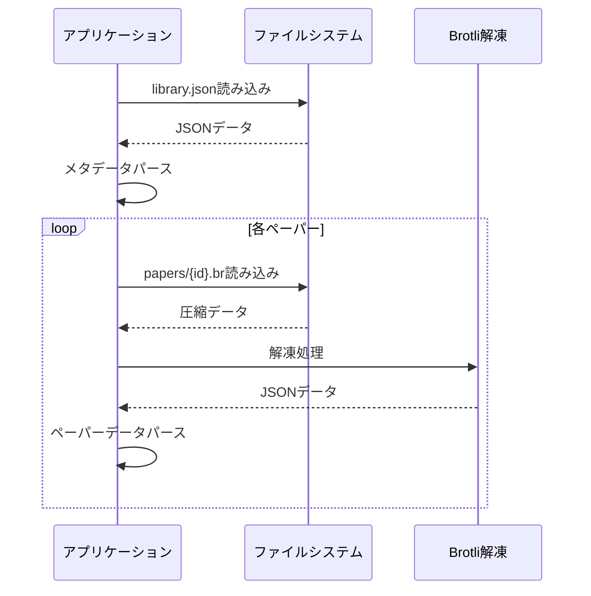
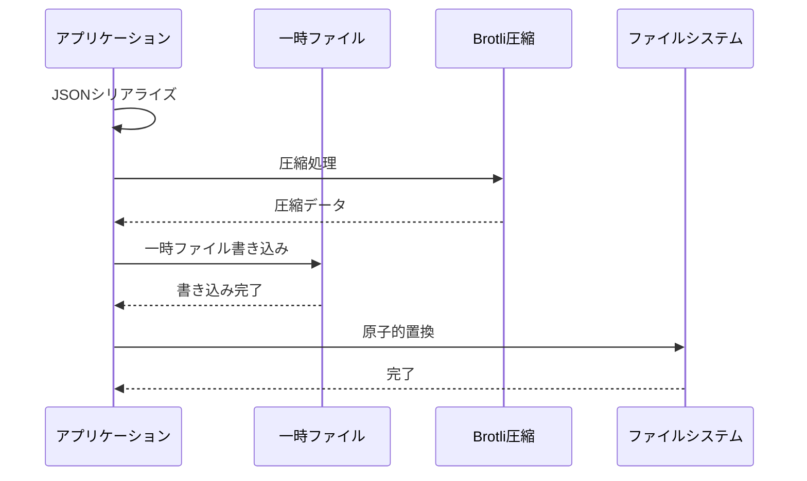

# ローカルストレージ仕様書

## 概要

Pointlessアプリケーションのデータ永続化に関する仕様を定義します。すべてのユーザーデータはローカルファイルシステムに保存され、Brotli圧縮を使用して効率的なストレージを実現します。

## ストレージ構造

### ディレクトリ構成

```
{AppDataDir}/
├── library.json          # ライブラリメタデータ
├── settings.json         # アプリケーション設定
└── papers/              # 個別ペーパーデータ
    ├── {paperId}.br     # Brotli圧縮されたペーパーデータ
    ├── {paperId}.br     # ...
    └── ...
```

### プラットフォーム別のAppDataDir

| OS | パス |
|-----|------|
| Windows | `%APPDATA%\Pointless\` |
| macOS | `~/Library/Application Support/Pointless/` |
| Linux | `~/.config/pointless/` |

## ファイル仕様

### 1. library.json

#### 構造

```json
{
  "version": 1,
  "folders": [
    {
      "id": "550e8400-e29b-41d4-a716-446655440000",
      "name": "My Sketches",
      "updatedAt": "2025-08-01T10:30:00.000Z",
      "createdAt": "2025-08-01T10:30:00.000Z"
    }
  ],
  "papers": [
    {
      "id": "6ba7b810-9dad-11d1-80b4-00c04fd430c8",
      "name": "Untitled",
      "folderId": "550e8400-e29b-41d4-a716-446655440000",
      "updatedAt": "2025-08-01T10:35:00.000Z",
      "createdAt": "2025-08-01T10:35:00.000Z"
    }
  ]
}
```

#### 特徴
- **形式**: JSON（整形済み、インデント2スペース）
- **エンコーディング**: UTF-8
- **サイズ**: 通常1KB〜100KB
- **更新頻度**: メタデータ変更時のみ

### 2. settings.json

#### 構造

```json
{
  "isDarkMode": false,
  "platform": "darwin",
  "appVersion": "1.11.0",
  "sortPapersBy": 2,
  "viewMode": 0,
  "canvasPreferredLinewidth": 1
}
```

#### 特徴
- **形式**: JSON（整形済み）
- **エンコーディング**: UTF-8
- **サイズ**: 通常1KB未満
- **更新頻度**: 設定変更時のみ

### 3. papers/{paperId}.br

#### 圧縮前の構造（JSON）

```json
{
  "id": "6ba7b810-9dad-11d1-80b4-00c04fd430c8",
  "name": "Untitled",
  "folderId": "550e8400-e29b-41d4-a716-446655440000",
  "shapes": [
    {
      "type": "FREEHAND",
      "color": "#000000",
      "linewidth": 2,
      "points": [
        {"x": 100, "y": 100},
        {"x": 101, "y": 102},
        {"x": 102, "y": 104}
      ]
    },
    {
      "type": "RECTANGLE",
      "color": "#FF0000",
      "linewidth": 1,
      "x1": 50,
      "y1": 50,
      "x2": 150,
      "y2": 100,
      "preserveAspectRatio": false
    }
  ],
  "updatedAt": "2025-08-01T10:35:00.000Z",
  "createdAt": "2025-08-01T10:35:00.000Z"
}
```

#### Brotli圧縮仕様

```rust
// Rust実装（src-tauri/src/file.rs）
pub fn compress(filename: &str, contents: &str) -> bool {
    let mut writer = brotli::CompressorWriter::new(
        File::create(filename).unwrap(), 
        4096,    // バッファサイズ
        11,      // 圧縮品質（0-11、11が最高）
        22       // ウィンドウサイズ（10-24）
    );
    write!(&mut writer, "{}", contents).expect("Could not compress contents");
    true
}
```

#### 圧縮パラメータ
- **圧縮品質**: 11（最高品質）
- **ウィンドウサイズ**: 22（4MB）
- **バッファサイズ**: 4096バイト
- **圧縮率**: 通常60-80%削減

## ファイル操作

### 読み込み処理



### 書き込み処理



## データ整合性保証

### 1. 原子的ファイル操作

```typescript
// 擬似コード
async function saveFile(path: string, data: string): Promise<void> {
  const tempPath = `${path}.tmp`;
  
  try {
    // 一時ファイルに書き込み
    await writeFile(tempPath, data);
    
    // 原子的に置換
    await rename(tempPath, path);
  } catch (error) {
    // エラー時は一時ファイルを削除
    await unlink(tempPath).catch(() => {});
    throw error;
  }
}
```

### 2. バックアップ戦略

```
papers/
├── {paperId}.br          # 現在のデータ
└── .backup/             # バックアップディレクトリ
    └── {paperId}.br.bak  # 前回の保存データ
```

### 3. 破損検出

- **チェックサム**: 各ファイルのMD5ハッシュを保存
- **JSON検証**: パース時の構造検証
- **スキーマバージョン**: 互換性チェック

## パフォーマンス最適化

### 1. 遅延読み込み

```typescript
class PaperLoader {
  private cache: Map<string, Paper> = new Map();
  
  async loadPaper(id: string): Promise<Paper> {
    // キャッシュチェック
    if (this.cache.has(id)) {
      return this.cache.get(id)!;
    }
    
    // ファイルから読み込み
    const compressed = await readFile(`papers/${id}.br`);
    const json = await decompress(compressed);
    const paper = JSON.parse(json);
    
    // キャッシュに保存
    this.cache.set(id, paper);
    return paper;
  }
}
```

### 2. バッチ保存

```typescript
class SaveQueue {
  private queue: Map<string, Paper> = new Map();
  private timer: NodeJS.Timeout | null = null;
  
  addToQueue(paper: Paper): void {
    this.queue.set(paper.id, paper);
    
    // 既存のタイマーをクリア
    if (this.timer) clearTimeout(this.timer);
    
    // 3秒後に保存実行
    this.timer = setTimeout(() => this.flush(), 3000);
  }
  
  private async flush(): Promise<void> {
    const papers = Array.from(this.queue.values());
    this.queue.clear();
    
    // 並列保存
    await Promise.all(papers.map(p => this.savePaper(p)));
  }
}
```

### 3. 圧縮キャッシュ

- 変更されていないペーパーは再圧縮しない
- 圧縮済みデータのメモリキャッシュ
- LRUキャッシュで メモリ使用量制限

## エラーハンドリング

### 1. 読み込みエラー

| エラー種別 | 対処法 |
|-----------|--------|
| ファイル不在 | デフォルト値を使用 |
| 解凍エラー | バックアップから復元 |
| JSONパースエラー | エラーログ記録、スキップ |
| 権限エラー | ユーザーに通知 |

### 2. 書き込みエラー

| エラー種別 | 対処法 |
|-----------|--------|
| ディスク容量不足 | ユーザーに警告表示 |
| 権限エラー | 別の場所を提案 |
| 圧縮エラー | 非圧縮で保存を試行 |

## セキュリティ考慮事項

### 1. ファイルアクセス権限

- **Unix系**: 600（所有者のみ読み書き可能）
- **Windows**: 所有者のみアクセス可能

### 2. データ検証

```typescript
// ファイル名のサニタイズ
function sanitizeFilename(name: string): string {
  return name.replace(/[^a-zA-Z0-9-_]/g, '');
}

// パスのトラバーサル防止
function validatePath(path: string): boolean {
  return !path.includes('..') && !path.includes('~');
}
```

### 3. 暗号化（将来実装）

- ユーザーオプションでAES-256暗号化
- パスワード派生鍵（PBKDF2）
- 暗号化メタデータの別管理

## 移行とアップグレード

### スキーマ移行

```typescript
interface MigrationStrategy {
  fromVersion: number;
  toVersion: number;
  migrate: (data: any) => any;
}

const migrations: MigrationStrategy[] = [
  {
    fromVersion: 1,
    toVersion: 2,
    migrate: (data) => {
      // バージョン1から2への移行ロジック
      return { ...data, newField: 'default' };
    }
  }
];
```

### データエクスポート/インポート

- **エクスポート形式**: ZIP（非圧縮JSON + メタデータ）
- **インポート検証**: スキーマ検証とサニタイズ
- **部分インポート**: フォルダ/ペーパー単位での選択的インポート