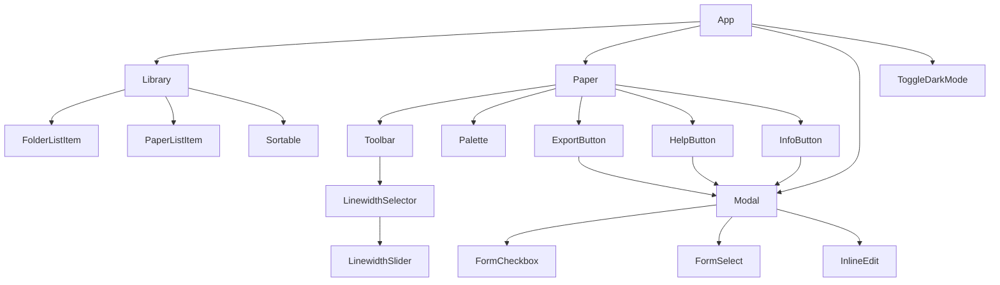
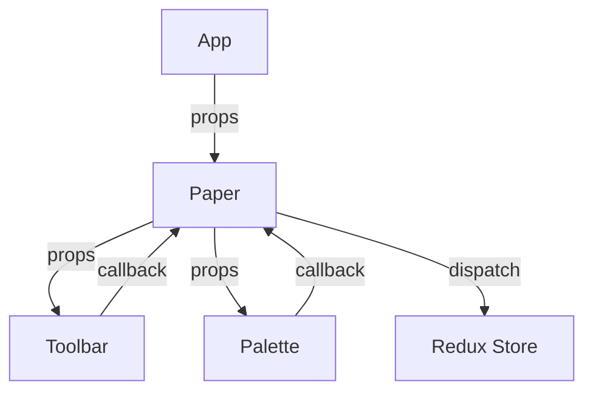
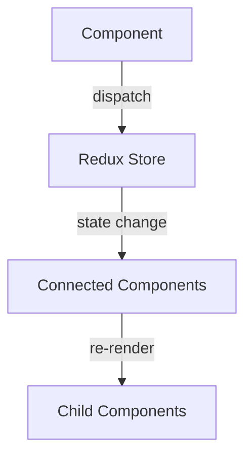
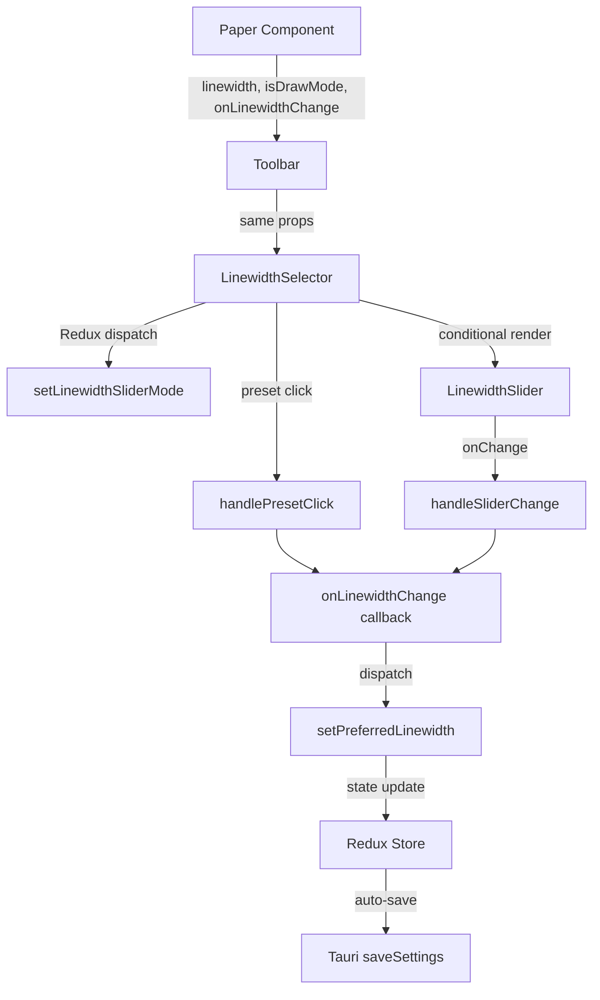

# React コンポーネント間インタフェース仕様書

## 概要

PointlessアプリケーションにおけるReactコンポーネント間のProps、State、イベントハンドラーの仕様を定義します。コンポーネント間のデータ受け渡しパターンと通信フローを詳細に記載します。

## コンポーネント階層図



## 主要コンポーネントのインタフェース

### 1. App Component

#### Props
```typescript
interface AppProps {
  // Reduxから自動注入されるため、外部Propsなし
}
```

#### State（Redux経由）
```typescript
interface AppState {
  router: {
    current: 'library' | 'paper';
    args?: { paperId?: string };
  };
  settings: {
    isDarkMode: boolean;
    platform: string;
  };
}
```

#### 責務
- 最上位コンポーネント
- ルーティング制御
- グローバル設定の反映

### 2. Library Component

#### Props
```typescript
interface LibraryProps {
  // Redux connect で自動注入
}
```

#### Redux State Mapping
```typescript
const mapStateToProps = (state: RootState) => ({
  library: state.library,
  preferredSortBy: state.settings.sortPapersBy,
  preferredViewMode: state.settings.viewMode,
  activeFolderId: state.library.currentFolderId,
});
```

#### 内部State
```typescript
interface LibraryState {
  currentFolderId: string | null;
  sortBy: SortBy;
  viewMode: ViewMode;
}
```

#### 主要メソッド
```typescript
class Library extends React.Component {
  newFolder(): void;
  setCurrentFolder(folderId: string): void;
  openPaper(paperId: string): void;
  newPaperInFolder(): void;
  onSort(sortBy: SortBy): void;
  onChangeViewMode(event: React.ChangeEvent<HTMLSelectElement>): void;
}
```

### 3. Paper Component

#### Props
```typescript
interface PaperProps {
  paperId: string;
  paper: Paper;
  isDarkMode: boolean;
}
```

#### 内部State
```typescript
interface PaperState {
  userLastActiveAt: string;
  librarySynced: boolean;
  selectedColor: string;
  linewidth: LineWidth;
  mode: DrawingMode;
  eraserSize: number;
  clipboard: Shape[];
  
  // カーソル位置
  cursorX: number;
  cursorY: number;
  prevCursorX: number;
  prevCursorY: number;
  
  // 描画状態
  isDrawing: boolean;
  isPanning: boolean;
  isErasing: boolean;
  isSelecting: boolean;
  isMovingSelection: boolean;
  
  // キャンバス変換
  translateX: number;
  translateY: number;
  scale: number;
  
  // 描画データ
  shapes: Shape[];
  currentShape: Partial<Shape>;
  selectedShapeIndexes: number[];
  
  // 履歴管理
  history: Shape[][];
  undoHistory: Shape[][];
}
```

#### イベントハンドラー
```typescript
interface PaperEventHandlers {
  // マウス/タッチイベント
  onMouseDown(event: React.MouseEvent): void;
  onMouseMove(event: React.MouseEvent): void;
  onMouseUp(event: React.MouseEvent): void;
  
  // キーボードイベント  
  onKeyDown(event: React.KeyboardEvent): void;
  onKeyUp(event: React.KeyboardEvent): void;
  
  // ホイールイベント
  onWheel(event: React.WheelEvent): void;
  
  // ツール切り替え
  onClickFreehandTool(): void;
  onClickRectangleTool(): void;
  onClickEllipseTool(): void;
  onClickArrowTool(): void;
  onClickEraseTool(): void;
  onClickSelectTool(): void;
  onClickPanTool(): void;
  
  // キャンバス操作
  onZoomIn(): void;
  onZoomOut(): void;
  onClickZoomToFit(): void;
  onClickResetZoom(): void;
  onClearCanvas(): void;
  
  // 履歴操作
  onClickUndoTool(): void;
  onClickRedoTool(): void;
  
  // 色・線幅変更
  onSelectColor(color: string): void;
  onLinewidthChange(linewidth: number): void;
}
```

### 4. Toolbar Component

#### Props
```typescript
interface ToolbarProps {
  // 現在の状態
  mode: DrawingMode;
  linewidth: number;
  canUndo: boolean;
  canRedo: boolean;
  canResetZoom: boolean;
  canvasIsEmpty: boolean;
  
  // モード判定
  isDrawMode: boolean;
  isEraseMode: boolean;
  isSelectMode: boolean;
  isPanMode: boolean;
  
  // イベントハンドラー
  onClickFreehandTool(): void;
  onClickEllipseTool(): void;
  onClickRectangleTool(): void;
  onClickArrowTool(): void;
  onClickEraseTool(): void;
  onClickSelectTool(): void;
  onClickPanTool(): void;
  onClickZoomToFit(): void;
  onClickUndoTool(): void;
  onClickRedoTool(): void;
  onClickResetZoom(): void;
  onZoomIn(): void;
  onZoomOut(): void;
  onClearCanvas(): void;
  onLinewidthChange(linewidth: number): void;
}
```

#### 使用例
```typescript
<Toolbar
  mode={this.state.mode}
  linewidth={this.state.linewidth}
  canUndo={this.state.history.length > 0}
  canRedo={this.state.undoHistory.length > 0}
  isDrawMode={this.isDrawMode()}
  onClickFreehandTool={this.onClickFreehandTool}
  onSelectColor={this.onSelectColor}
  // ... その他のprops
/>
```

### 5. Palette Component

#### Props
```typescript
interface PaletteProps {
  paperId: string;
  selectedColor: string;
  selectedShapes: Shape[];
  onSelectColor(color: string): void;
}
```

#### 内部State
```typescript
interface PaletteState {
  paletteColor: string;          // カスタムカラー
  customColor: boolean;          // カスタムカラー選択中
  colorSelectorToolVisible: boolean; // カラーピッカー表示
}
```

#### イベントハンドラー
```typescript
interface PaletteEventHandlers {
  handlePaletteChange(color: ColorResult): void;
  handleChangeComplete(color: ColorResult): void;
  handleSelectCustom(): void;
  handleSelectColor(color: string): void;
  handleColorSelectorTool(): void;
}
```

### 6. Modal Component

#### Props
```typescript
interface ModalProps {
  title: string;
  open: boolean;
  size?: 'small' | 'medium';
  actions?: React.ReactNode | React.ReactNode[];
  children: React.ReactNode;
  onClose(): void;
}
```

#### デフォルトProps
```typescript
Modal.defaultProps = {
  size: 'small',
  open: false,
  onClose: () => {},
};
```

#### 使用例
```typescript
<Modal
  open={this.state.open}
  title="Export paper"
  onClose={this.toggleOpen}
  actions={
    <button className="btn btn-primary" onClick={this.export}>
      Export
    </button>
  }
>
  <div className="form-group">
    {/* フォーム内容 */}
  </div>
</Modal>
```

### 7. FolderListItem Component

#### Props
```typescript
interface FolderListItemProps {
  folder: Folder;
  isActive: boolean;
  onClick(): void;
  onDelete(): void;
}
```

#### デフォルトProps  
```typescript
FolderListItem.defaultProps = {
  onClick: () => {},
  onDelete: () => {},
  isActive: false,
};
```

#### イベント処理
```typescript
const onClick = (e: React.MouseEvent) => {
  // ボタンクリック時は親のonClickを呼ばない
  if (e.target.nodeName === 'BUTTON') return false;
  
  // フォルダ内容を読み込み
  store.dispatch(loadFolderContents(props.folder.id));
  props.onClick();
};
```

### 8. PaperListItem Component

#### Props
```typescript
interface PaperListItemProps {
  paper: Paper;
  viewMode: ViewMode;
  index: number;
  onClick(): void;
}
```

#### 条件付きレンダリング
```typescript
// リストビューの場合
if (props.viewMode === VIEW_MODE.LIST) {
  return (
    <tr onClick={onClickListViewItem}>
      <td>{props.index + 1}</td>
      <td>
        <InlineEdit 
          defaultValue={props.paper.name} 
          onEditDone={onEditPaperName} 
        />
      </td>
      {/* その他のセル */}
    </tr>
  );
}

// グリッドビューの場合（デフォルト）
return (
  <div onClick={onClickGridViewItem}>
    <Paper paperId={props.paper.id} readonly />
    <div>
      <InlineEdit 
        defaultValue={props.paper.name} 
        onEditDone={onEditPaperName} 
      />
    </div>
  </div>
);
```

### 9. InlineEdit Component

#### Props
```typescript
interface InlineEditProps {
  defaultValue: string;
  onEditDone(newValue: string): void;
}
```

#### 内部State
```typescript
interface InlineEditState {
  isEditing: boolean;
  value: string;
  originalValue: string;
}
```

#### イベントハンドラー
```typescript
interface InlineEditEventHandlers {
  startEdit(): void;
  handleChange(event: React.ChangeEvent<HTMLInputElement>): void;
  handleKeyDown(event: React.KeyboardEvent): void;
  handleBlur(): void;
  saveEdit(): void;
  cancelEdit(): void;
}
```

## コンポーネント間通信パターン

### 1. Props Drilling



### 2. Redux State Management



### 3. Event Propagation

```typescript
// イベントの伝播制御例
const handleClick = (event: React.MouseEvent) => {
  // 特定の条件でイベント伝播を停止
  if (shouldStopPropagation(event)) {
    event.stopPropagation();
    return;
  }
  
  // 親コンポーネントのハンドラーを呼び出し
  props.onClick?.(event);
};
```

## TypeScript型定義

### 共通型定義

```typescript
// イベントハンドラー型
type EventHandler<T = void> = (event: React.SyntheticEvent) => T;
type ClickHandler = EventHandler<void>;
type ChangeHandler<T> = (value: T) => void;

// コンポーネントProps型
type ComponentProps<T = {}> = T & {
  className?: string;
  style?: React.CSSProperties;
  children?: React.ReactNode;
};

// Redux接続型
type ConnectedProps<T> = T & {
  dispatch: Dispatch<AnyAction>;
};
```

### Props検証

```typescript
// PropTypesを使用した実行時型チェック
Modal.propTypes = {
  title: PropTypes.string,
  actions: PropTypes.oneOfType([
    PropTypes.arrayOf(PropTypes.node), 
    PropTypes.node
  ]),
  size: PropTypes.oneOf(['small', 'medium']),
  open: PropTypes.bool,
  onClose: PropTypes.func,
};
```

## パフォーマンス最適化

### 1. React.memo

```typescript
// 軽量コンポーネントのメモ化
export default memo(Toolbar);
export default memo(Palette);
```

### 2. useCallback/useMemo

```typescript
// イベントハンドラーのメモ化
const handleClick = useCallback(() => {
  props.onClick?.();
}, [props.onClick]);

// 計算結果のメモ化
const sortedPapers = useMemo(() => {
  return papers.sort(sortFunction);
}, [papers, sortBy]);
```

### 3. 条件付きレンダリング

```typescript
// 不要なレンダリングを避ける
{isVisible && <ExpensiveComponent />}
{papers.length > 0 && <PaperList papers={papers} />}
```

### 10. LinewidthSelector Component

#### Props
```typescript
interface LinewidthSelectorProps {
  linewidth: number;
  isDrawMode: boolean;
  onLinewidthChange(value: number): void;
}
```

#### Redux Integration
```typescript
const linewidthSliderMode = useSelector((state: RootState) => 
  state.settings.linewidthSliderMode
);
```

#### 内部State
```typescript
interface LinewidthSelectorState {
  sliderValue: number;
  lastValidValue: number;
}
```

#### 主要メソッド
```typescript
const handlePresetClick = (presetValue: number): void;
const handleSliderChange = (value: number): void;
const handleModeToggle = (): void;
```

#### 責務
- プリセットボタン（小・中・大）の管理
- スライダーモードの切り替え制御
- Redux状態との同期
- プリセット値とカスタム値の調整

### 11. LinewidthSlider Component

#### Props
```typescript
interface LinewidthSliderProps {
  value: number;
  min?: number;
  max?: number;
  step?: number;
  disabled?: boolean;
  onChange?(value: number): void;
  onChangeComplete?(value: number): void;
}
```

#### デフォルトProps
```typescript
LinewidthSlider.defaultProps = {
  min: 1,
  max: 20,
  step: 1,
  disabled: false,
};
```

#### 内部State
```typescript
interface LinewidthSliderState {
  isHovered: boolean;
  isDragging: boolean;
  isFocused: boolean;
  announceValue: string;
}
```

#### イベントハンドラー
```typescript
interface LinewidthSliderEventHandlers {
  handleSliderChange(event: React.ChangeEvent<HTMLInputElement>): void;
  handleSliderChangeComplete(event: React.MouseEvent | React.TouchEvent): void;
  handleKeyDown(event: React.KeyboardEvent): void;
  handleFocus(): void;
  handleBlur(): void;
}
```

#### キーボードナビゲーション
```typescript
// サポートされるキー操作
const keyboardActions = {
  'ArrowLeft': () => decreaseValue(1),
  'ArrowRight': () => increaseValue(1),
  'ArrowDown': () => decreaseValue(1),
  'ArrowUp': () => increaseValue(1),
  'Home': () => setValue(min),
  'End': () => setValue(max),
  'PageDown': () => decreaseValue(5),
  'PageUp': () => increaseValue(5),
};
```

#### アクセシビリティ属性
```typescript
const accessibilityProps = {
  'role': 'slider',
  'aria-label': 'Line width slider',
  'aria-valuemin': min,
  'aria-valuemax': max,
  'aria-valuenow': value,
  'aria-valuetext': `${value} pixels`,
  'aria-describedby': 'linewidth-slider-desc',
  'tabIndex': disabled ? -1 : 0,
};
```

#### 責務
- スライダーUIの描画と操作処理
- 値の範囲制限とステップ制御
- リアルタイムプレビュー表示
- キーボードナビゲーション対応
- スクリーンリーダー対応

## 新機能統合パターン

### LinewidthSelector統合フロー



### モード切り替えロジック

```typescript
// プリセットモード → スライダーモード
const switchToSliderMode = () => {
  dispatch(setLinewidthSliderMode(true));
  // 現在のプリセット値を保持
};

// スライダーモード → プリセットモード  
const switchToPresetMode = (currentValue: number) => {
  dispatch(setLinewidthSliderMode(false));
  
  if (!isPresetLinewidth(currentValue)) {
    // カスタム値の場合、最も近いプリセットに調整
    const closestPreset = getClosestPresetLinewidth(currentValue);
    onLinewidthChange(closestPreset);
  }
};
```

### エラーハンドリングパターン

```typescript
// バリデーション付きイベントハンドラー
const handleValueChange = (value: number) => {
  try {
    const validatedValue = validateLinewidth(value);
    setSliderValue(validatedValue);
    onLinewidthChange(validatedValue);
  } catch (error) {
    console.error('Error in handleValueChange:', error);
    // フォールバック処理
    const fallbackValue = validateLinewidth(lastValidValue);
    onLinewidthChange(fallbackValue);
  }
};
```

このReactコンポーネント間インタフェース仕様により、コンポーネント間の明確な責務分離と効率的なデータフローが実現されています。新しいLinewidthSelectorとLinewidthSliderコンポーネントも既存のアーキテクチャパターンに準拠し、堅牢で保守性の高い実装となっています。