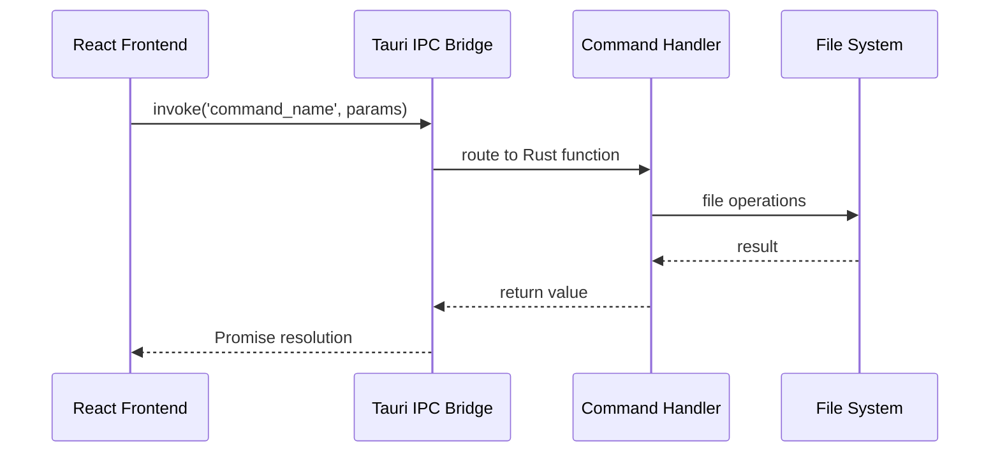
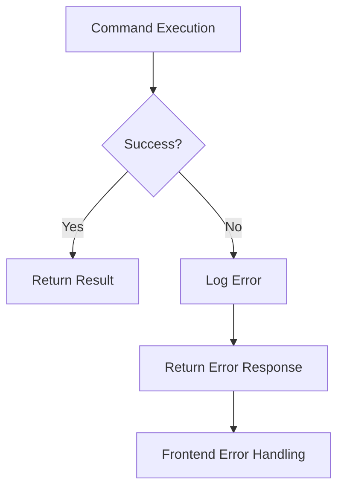

# Tauri APIインタフェース仕様書

## 概要

Pointlessアプリケーションのフロントエンド（React）とバックエンド（Rust）間の通信インタフェースを定義します。Tauri APIを通じたファイル操作、設定管理、システム連携の全APIエンドポイントを詳細に記載します。

## API通信アーキテクチャ

### 通信フロー



### エラーハンドリング



## API一覧

### 1. ライブラリ管理API

#### 1.1 フォルダ読み込み

```rust
#[tauri::command]
async fn load_library_folders(handle: AppHandle) -> Option<Vec<serde_json::Value>>
```

**説明**: ライブラリ内の全フォルダ情報を読み込み

**パラメータ**: なし

**戻り値**: 
```typescript
Folder[] | null
```

**処理フロー**:
1. ライブラリディレクトリのパス取得
2. 各フォルダの`folder_info.br`ファイルを読み込み
3. Brotli解凍してJSONパース
4. フォルダ配列として返却

**使用例**:
```typescript
const folders = await invoke<Folder[]>('load_library_folders');
```

#### 1.2 フォルダ内ペーパー読み込み

```rust
#[tauri::command]
async fn load_library_folder_papers(
    handle: AppHandle, 
    folderId: String
) -> Option<Vec<serde_json::Value>>
```

**説明**: 指定フォルダ内の全ペーパーを読み込み

**パラメータ**:
| 名前 | 型 | 説明 |
|------|---|------|
| folderId | String | フォルダID |

**戻り値**:
```typescript
Paper[] | null
```

**処理フロー**:
1. フォルダパス構築
2. ディレクトリ内の`.br`ファイル一覧取得
3. 各ペーパーファイルをBrotli解凍
4. ペーパー配列として返却

**使用例**:
```typescript
const papers = await invoke<Paper[]>('load_library_folder_papers', {
  folderId: 'folder-uuid'
});
```

#### 1.3 ライブラリ保存

```rust
#[tauri::command]
async fn save_library(handle: AppHandle, library_state: String)
```

**説明**: ライブラリ全体の状態をファイルシステムに保存

**パラメータ**:
| 名前 | 型 | 説明 |
|------|---|------|
| library_state | String | JSON文字列化されたライブラリ状態 |

**戻り値**: なし

**処理フロー**:
1. JSON文字列をパース
2. フォルダごとにディレクトリ作成
3. `folder_info.br`ファイルを圧縮保存
4. 各ペーパーを`{paperId}.br`として圧縮保存

**データ構造**:
```typescript
interface LibraryState {
  folders: Folder[];
  papers: Paper[];
}
```

**使用例**:
```typescript
await invoke('save_library', {
  libraryState: JSON.stringify(libraryState)
});
```

#### 1.4 フォルダ削除

```rust
#[tauri::command]
async fn delete_library_folder(handle: AppHandle, folderId: String)
```

**説明**: 指定フォルダとその中身を完全削除

**パラメータ**:
| 名前 | 型 | 説明 |
|------|---|------|
| folderId | String | 削除対象フォルダID |

**戻り値**: なし

**処理フロー**:
1. フォルダパス構築
2. ディレクトリの存在確認
3. `fs::remove_dir_all`で再帰削除
4. エラーログ出力（失敗時）

**使用例**:
```typescript
await invoke('delete_library_folder', {
  folderId: 'folder-uuid'
});
```

#### 1.5 ペーパー削除

```rust
#[tauri::command]
async fn delete_library_paper(
    handle: AppHandle, 
    folderId: String, 
    paperId: String
)
```

**説明**: 指定ペーパーファイルを削除

**パラメータ**:
| 名前 | 型 | 説明 |
|------|---|------|
| folderId | String | フォルダID |
| paperId | String | ペーパーID |

**戻り値**: なし

**処理フロー**:
1. ペーパーファイルパス構築
2. ファイル存在確認
3. `fs::remove_file`で削除
4. エラーログ出力（失敗時）

**使用例**:
```typescript
await invoke('delete_library_paper', {
  folderId: 'folder-uuid',
  paperId: 'paper-uuid'
});
```

### 2. 設定管理API

#### 2.1 設定保存

```rust
#[tauri::command]
async fn save_settings(handle: AppHandle, settings: String)
```

**説明**: アプリケーション設定をファイルに保存

**パラメータ**:
| 名前 | 型 | 説明 |
|------|---|------|
| settings | String | JSON文字列化された設定 |

**戻り値**: なし

**設定データ構造**:
```typescript
interface Settings {
  isDarkMode: boolean;
  platform: string;
  appVersion: string;
  sortPapersBy: number;
  viewMode: number;
  canvasPreferredLinewidth: number;
}
```

**使用例**:
```typescript
await invoke('save_settings', {
  settings: JSON.stringify(settingsState)
});
```

#### 2.2 設定読み込み

```rust
#[tauri::command]
async fn load_settings(handle: AppHandle) -> Option<serde_json::Value>
```

**説明**: 保存された設定ファイルを読み込み

**パラメータ**: なし

**戻り値**:
```typescript
Settings | null
```

**処理フロー**:
1. 設定ファイルパス取得
2. ファイル存在確認
3. Brotli解凍とJSONパース
4. 設定オブジェクト返却

**使用例**:
```typescript
const settings = await invoke<Settings>('load_settings');
```

## ファイルシステム構造

### ディレクトリレイアウト

```
{AppDataDir}/
├── settings.br           # アプリケーション設定（Brotli圧縮）
└── library/              # ライブラリルートディレクトリ
    ├── {folderId}/       # フォルダディレクトリ
    │   ├── folder_info.br # フォルダ情報（Brotli圧縮）
    │   ├── {paperId}.br   # ペーパーデータ（Brotli圧縮）
    │   └── ...
    └── ...
```

### ファイル命名規則

| ファイル種別 | 命名パターン | 説明 |
|-------------|-------------|------|
| 設定ファイル | `settings.br` | 固定名 |
| フォルダ情報 | `folder_info.br` | 固定名 |
| ペーパーデータ | `{paperId}.br` | UUIDベースの可変名 |

## エラーハンドリング

### エラー種別

| エラータイプ | 説明 | 対処法 |
|-------------|------|-------|
| FileNotFound | ファイル・ディレクトリが存在しない | None/null を返却 |
| PermissionDenied | ファイルアクセス権限なし | エラーログ出力 |
| CompressionError | Brotli圧縮・解凍エラー | パニック発生 |
| JsonParseError | JSON解析エラー | パニック発生 |
| IOError | その他のI/Oエラー | エラーログ出力 |

### エラーログ形式

```rust
eprintln!("Error removing folder {}: {:?}", folderId, e);
```

## パフォーマンス考慮事項

### 1. 圧縮設定

```rust
// Brotli圧縮パラメータ
let mut writer = brotli::CompressorWriter::new(
    File::create(filename).unwrap(), 
    4096,    // バッファサイズ
    11,      // 圧縮品質（最高）
    22       // ウィンドウサイズ
);
```

### 2. 非同期処理

全てのコマンドは`async`で定義され、I/O操作をブロックしません。

### 3. バッチ処理

ライブラリ保存時は、複数のファイル操作を一つのコマンドで処理します。

## セキュリティ考慮事項

### 1. パス検証

```rust
// パストラバーサル攻撃の防止
fn validate_path(path: &str) -> bool {
    !path.contains("..") && !path.contains("~")
}
```

### 2. ファイルアクセス制限

- アプリデータディレクトリ内のファイルのみアクセス可能
- システムファイルへのアクセス不可

### 3. 入力サニタイゼーション

```rust
// ファイル名の危険文字除去
fn sanitize_filename(name: &str) -> String {
    name.chars()
        .filter(|c| c.is_alphanumeric() || "-_".contains(*c))
        .collect()
}
```

## API使用パターン

### 1. 起動時初期化

```typescript
// アプリ起動時の標準的な初期化フロー
export const initializeApp = async () => {
  try {
    // 設定読み込み
    const settings = await invoke<Settings>('load_settings');
    if (settings) {
      dispatch(loadSettings(settings));
    }
    
    // フォルダ読み込み
    const folders = await invoke<Folder[]>('load_library_folders');
    if (folders) {
      dispatch(loadFolders(folders));
      
      // 各フォルダのペーパー読み込み
      for (const folder of folders) {
        const papers = await invoke<Paper[]>('load_library_folder_papers', {
          folderId: folder.id
        });
        if (papers) {
          dispatch(loadPapers(papers));
        }
      }
    }
  } catch (error) {
    console.error('Failed to initialize app:', error);
  }
};
```

### 2. 自動保存

```typescript
// Redux middleware での自動保存
const autoSaveMiddleware: Middleware = (store) => (next) => (action) => {
  const result = next(action);
  
  // 特定のアクション後に自動保存
  const saveActions = ['updateFolderName', 'updatePaperName', 'setPaperShapes'];
  
  if (saveActions.some(actionType => action.type.includes(actionType))) {
    const state = store.getState();
    invoke('save_library', {
      libraryState: JSON.stringify(state.library)
    }).catch(error => {
      console.error('Auto-save failed:', error);
    });
  }
  
  return result;
};
```

このTauri APIインタフェース仕様により、フロントエンドとバックエンド間の堅牢で効率的な通信が実現されています。