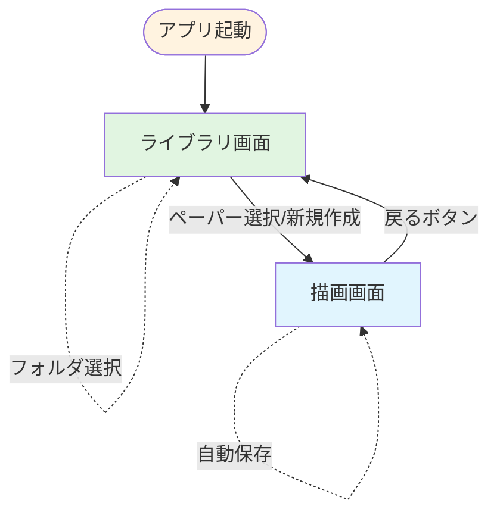
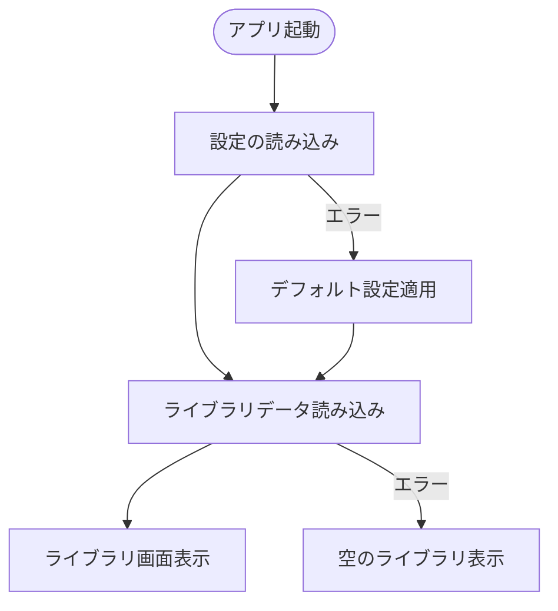
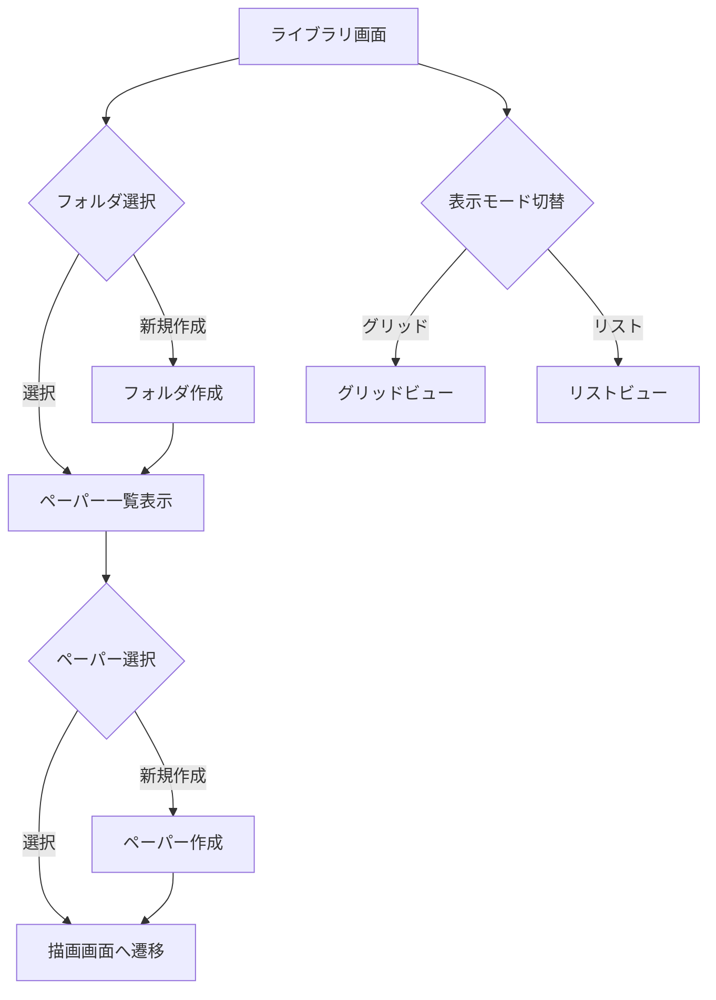
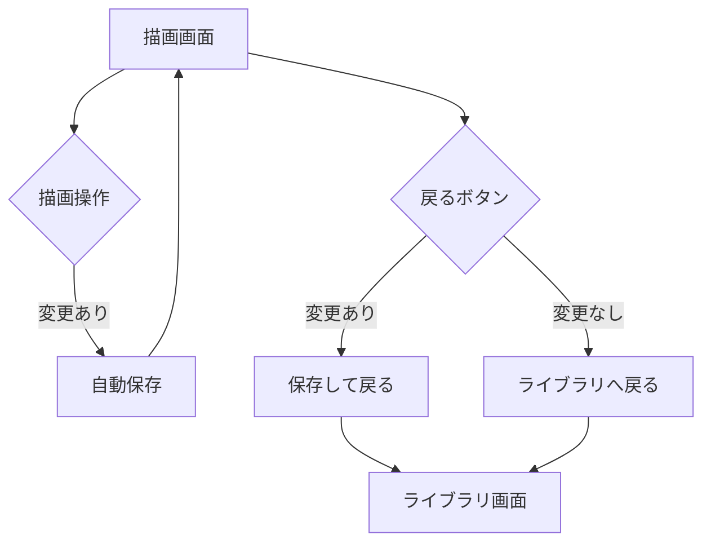
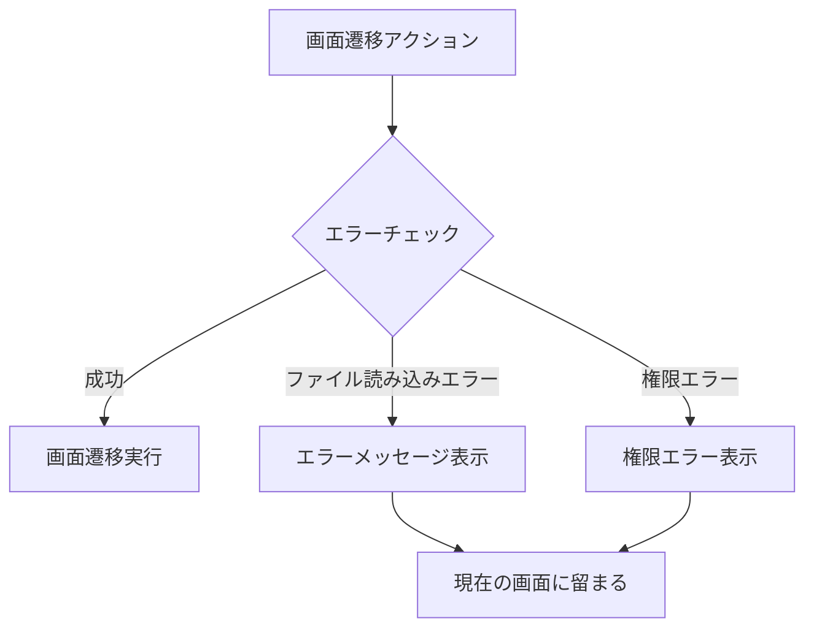

# メイン画面遷移フロー

## 概要

Pointlessアプリケーションの主要な画面間の遷移フローを定義します。アプリケーションは主に「ライブラリ画面」と「描画画面」の2つの主要画面で構成されています。

## 画面遷移図



## 詳細な画面遷移フロー

### 1. アプリケーション起動フロー



### 2. ライブラリ画面での操作フロー



### 3. 描画画面での操作フロー



## トリガーとアクション

### ライブラリ画面 → 描画画面

| トリガー | アクション | 備考 |
|---------|-----------|------|
| ペーパーサムネイルクリック | 選択されたペーパーを開く | グリッドビューの場合 |
| テーブル行クリック | 選択されたペーパーを開く | リストビューの場合 |
| 「new paper」ボタンクリック | 新規ペーパーを作成して開く | 選択中のフォルダに作成 |

### 描画画面 → ライブラリ画面

| トリガー | アクション | 備考 |
|---------|-----------|------|
| 左上の戻るボタンクリック | 自動保存してライブラリへ戻る | 変更がある場合のみ保存 |
| Escキー | 自動保存してライブラリへ戻る | キーボードショートカット |

### ライブラリ画面内での遷移

| トリガー | アクション | 備考 |
|---------|-----------|------|
| フォルダクリック | フォルダ内容を表示 | 画面遷移なし、内容更新のみ |
| 「new folder」ボタンクリック | 新規フォルダ作成 | 自動的に選択状態に |
| 表示モード切替 | ビューモード変更 | グリッド⇔リスト |
| ソート条件変更 | ペーパーの並び順変更 | 画面遷移なし |

## 状態管理

### Redux Routerの状態

```javascript
{
  router: {
    current: 'library' | 'paper',
    args: {
      paperId?: string  // 描画画面の場合のみ
    }
  }
}
```

### 画面遷移時の処理

1. **ライブラリ → 描画画面**
   - 選択されたペーパーIDをRedux stateに保存
   - ペーパーデータを読み込み
   - 描画画面コンポーネントをマウント

2. **描画画面 → ライブラリ**
   - 変更があれば自動保存
   - Redux stateのペーパーIDをクリア
   - ライブラリ画面を再表示

## エラーハンドリング



## パフォーマンス最適化

1. **遅延読み込み**
   - 描画画面コンポーネントは必要時のみ読み込み
   - ペーパーデータは選択時に読み込み

2. **状態の永続化**
   - 最後に開いていた画面を記憶
   - フォルダ選択状態の保持

3. **プリロード**
   - ホバー時に次の画面データを先読み
   - 画面遷移の高速化