# モーダル・オーバーレイ遷移フロー

## 概要

Pointlessアプリケーションにおけるモーダルダイアログ、オーバーレイ、ツールチップの表示フローを定義します。これらのUI要素は画面遷移を伴わず、現在の画面上にレイヤーとして表示されます。

## モーダル表示フロー

### 基本的なモーダル表示パターン

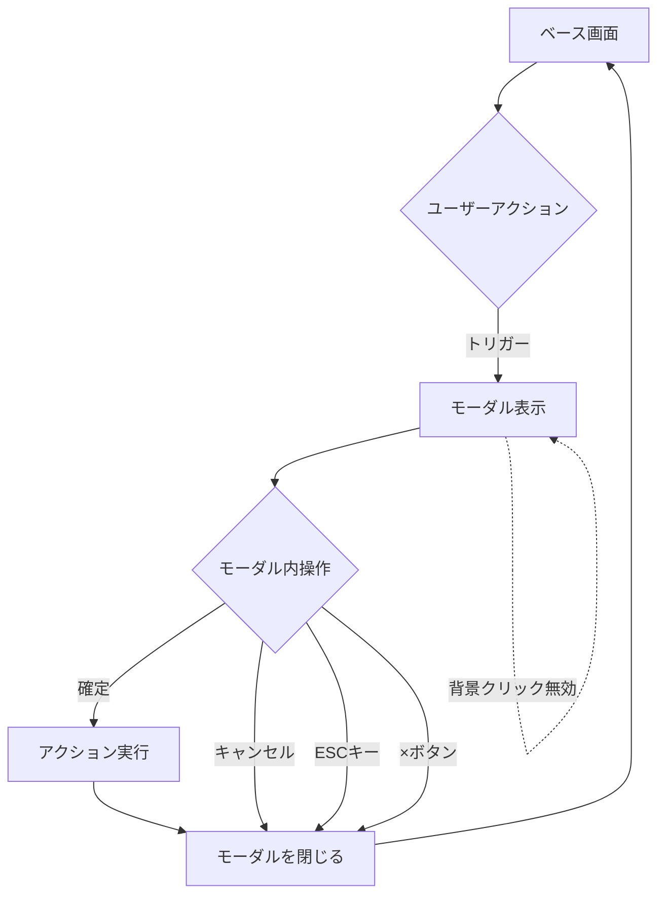

## 各モーダルの詳細フロー

### 1. エクスポートダイアログ

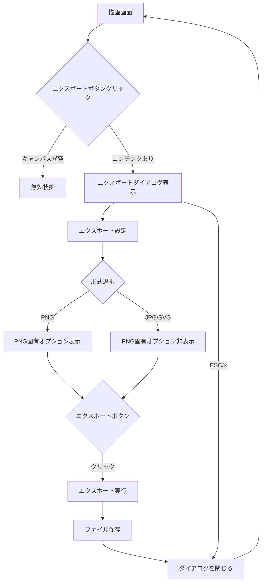

### 2. ヘルプダイアログ

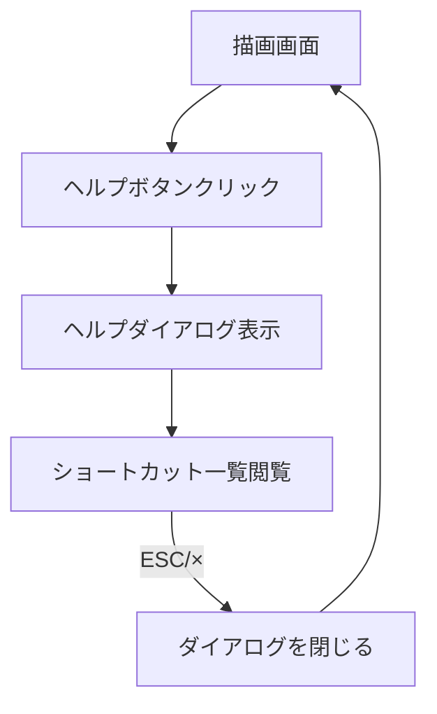

### 3. ペーパー情報ダイアログ

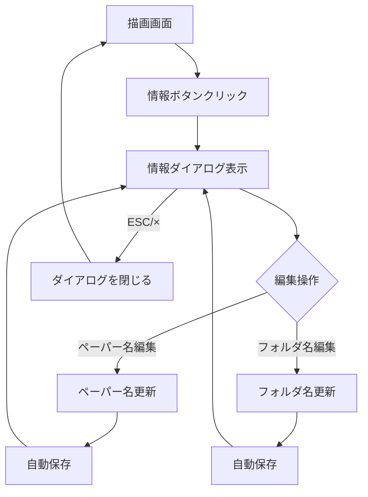

### 4. 確認ダイアログ（Tauri Native Dialog）

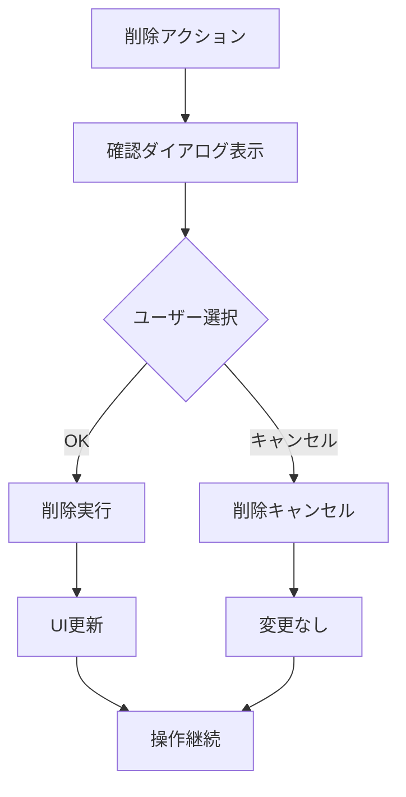

## オーバーレイ表示パターン

### 1. カラーピッカーオーバーレイ

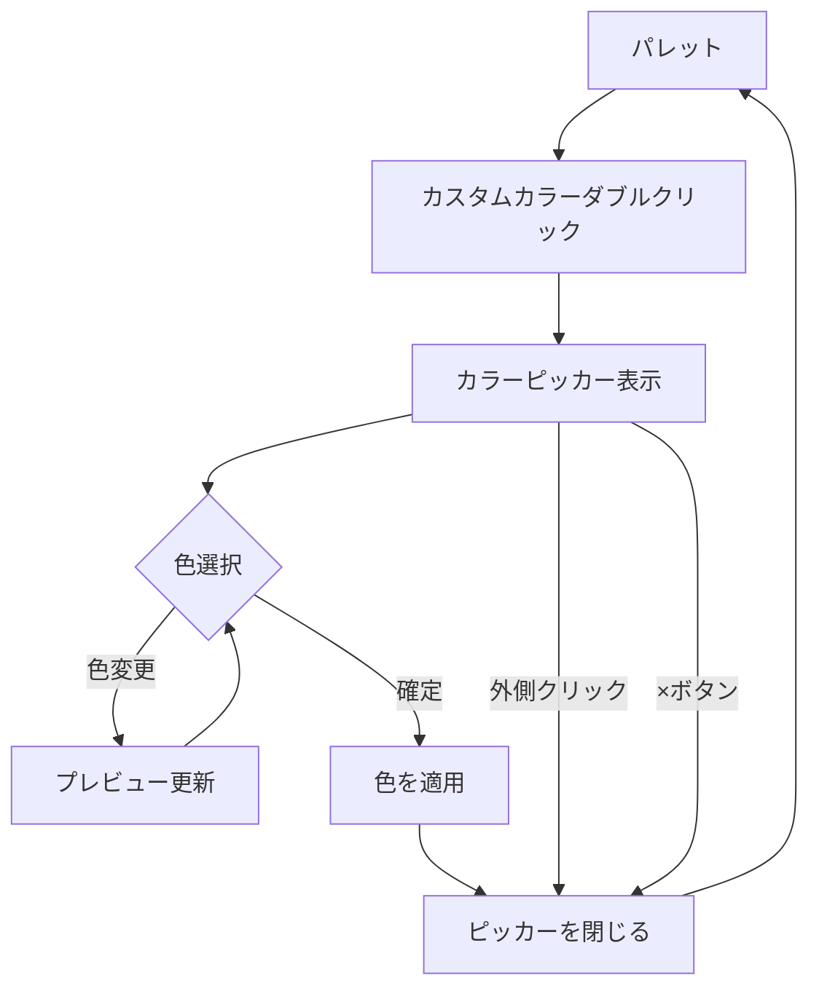

### 2. ツールチップ表示

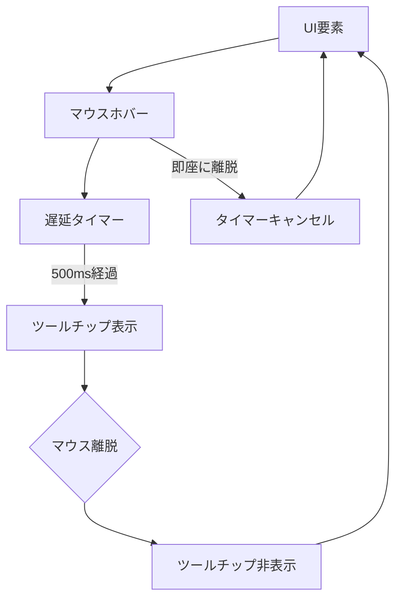

## インライン編集フロー

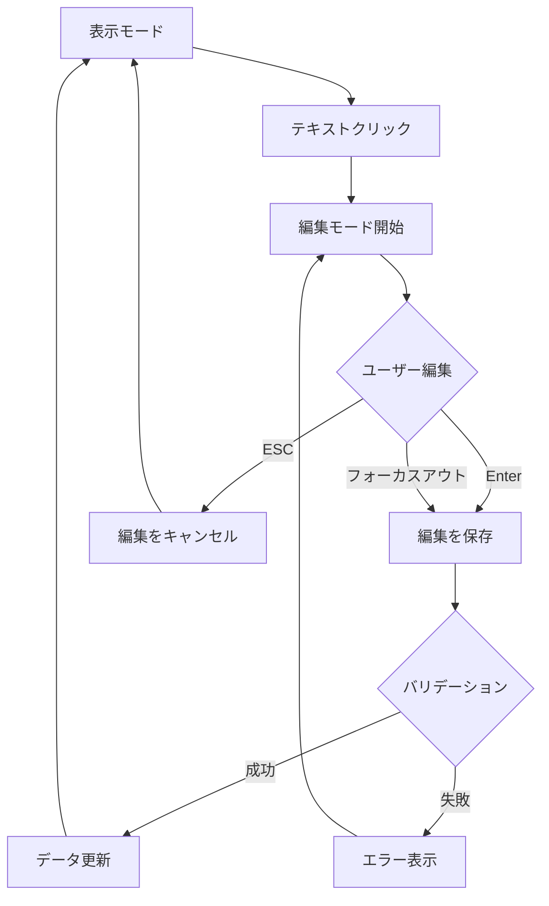

## モーダル間の相互作用

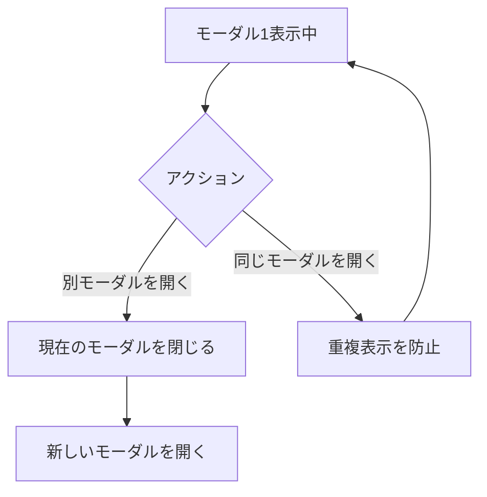

## エラー処理フロー

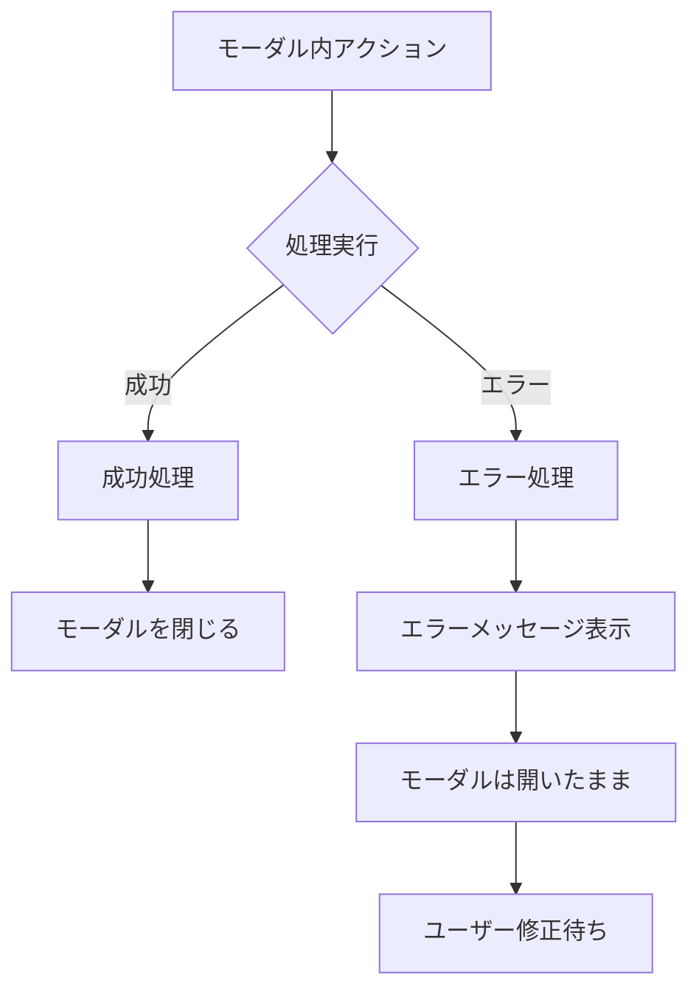

## アクセシビリティ考慮

### フォーカス管理

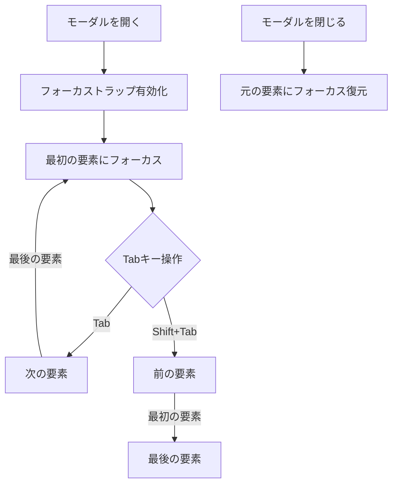

## パフォーマンス最適化

1. **遅延表示**
   - ツールチップは500ms後に表示
   - 頻繁な表示/非表示を防止

2. **アニメーション**
   - モーダル: 200msのフェードイン/アウト
   - オーバーレイ: 150msのトランジション

3. **メモリ管理**
   - 非表示時はDOMから削除
   - 大きなモーダルは遅延読み込み