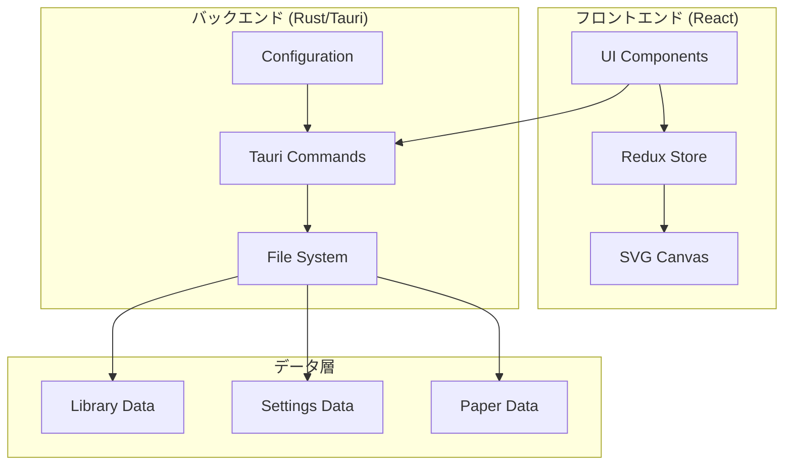
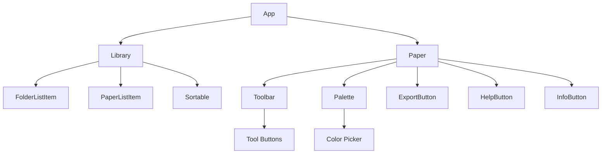
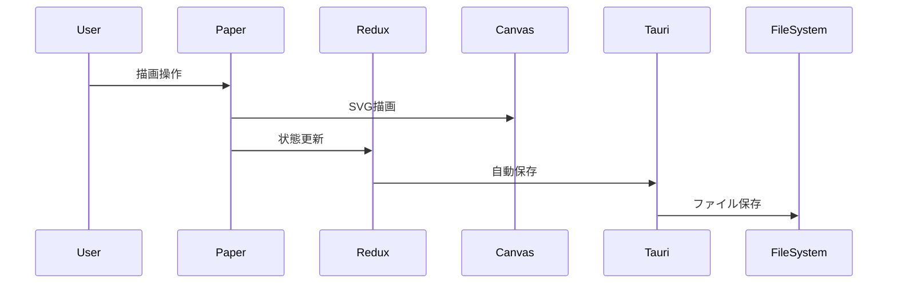
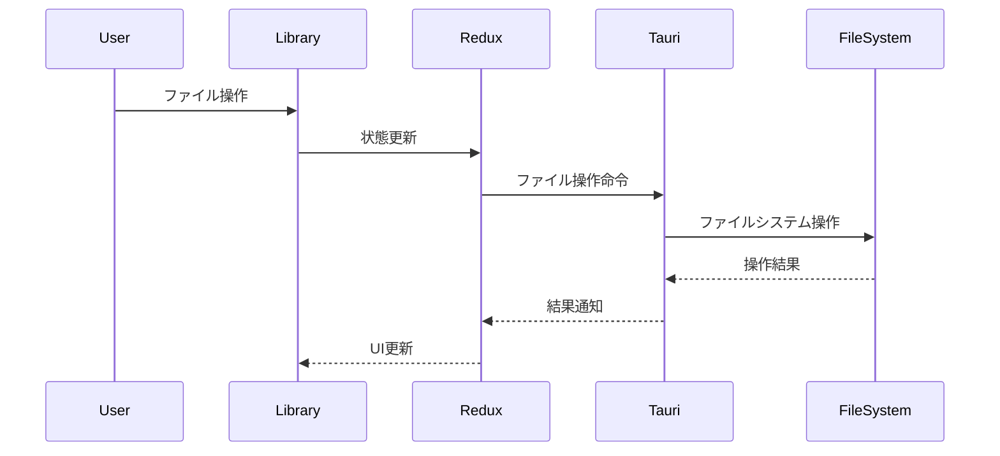

# ソフトウェアアーキテクチャ設計書

## 1. アーキテクチャ概要

### 1.1 アーキテクチャパターン

Pointlessアプリケーションは**Tauriアーキテクチャ**を採用し、以下の構成で実装されています：

- **フロントエンド**: React + Redux Toolkit
- **バックエンド**: Rust (Tauri)
- **通信**: Tauri Commands (IPC)
- **描画**: SVG Canvas
- **データ保存**: ローカルファイルシステム

### 1.2 システム構成図



## 2. レイヤー設計

### 2.1 プレゼンテーション層 (UI Layer)

#### 2.1.1 コンポーネント構成

```
src/components/
├── App/                 # メインアプリケーション
├── Library/            # ライブラリ画面
│   ├── components/
│   │   ├── FolderListItem/
│   │   └── PaperListItem/
├── Paper/              # 描画画面
│   ├── components/
│   │   ├── ExportButton/
│   │   ├── HelpButton/
│   │   ├── InfoButton/
│   │   ├── Palette/
│   │   └── Toolbar/
├── Modal/              # モーダルダイアログ
├── FormCheckbox/       # フォーム要素
├── FormSelect/         # フォーム要素
├── InlineEdit/         # インライン編集
├── Sortable/           # ソート機能
└── ToggleDarkMode/     # ダークモード切り替え
```

#### 2.1.2 状態管理

- **Redux Toolkit**: アプリケーション全体の状態管理
- **React Hooks**: コンポーネントローカル状態
- **Connect Pattern**: ReduxとReactコンポーネントの接続

### 2.2 ビジネスロジック層 (Business Logic Layer)

#### 2.2.1 Redux Store構成

```
src/reducers/
├── router/             # ルーティング状態
├── library/            # ライブラリ管理
├── paper/              # 描画状態
└── settings/           # アプリケーション設定
```

#### 2.2.2 主要なビジネスロジック

- **描画ロジック**: SVG描画、図形生成、選択処理
- **ファイル管理**: フォルダ・ペーパーのCRUD操作
- **エクスポート処理**: PNG/JPEG/SVG形式での出力
- **設定管理**: ユーザー設定の永続化

### 2.3 データアクセス層 (Data Access Layer)

#### 2.3.1 Tauri Commands

```rust
// src-tauri/src/commands.rs
- load_library_folder_papers()
- load_library_folders()
- delete_library_folder()
- delete_library_paper()
- save_library()
- save_settings()
- load_settings()
```

#### 2.3.2 ファイルシステム操作

- **圧縮/解凍**: brotli-unicodeによるデータ圧縮
- **ディレクトリ管理**: フォルダ構造の管理
- **設定ファイル**: JSON形式での設定保存

## 3. コンポーネント設計

### 3.1 コンポーネント階層



### 3.2 コンポーネント間通信

#### 3.2.1 Props経由の通信

- 親から子へのデータ渡し
- コールバック関数による子から親への通知

#### 3.2.2 Redux経由の通信

- グローバル状態の共有
- アクションによる状態更新

#### 3.2.3 Tauri Commands経由の通信

- フロントエンドからバックエンドへの命令
- ファイルシステム操作

## 4. データフロー設計

### 4.1 描画データフロー



### 4.2 ファイル管理データフロー



## 5. セキュリティ設計

### 5.1 データ保護

- **ローカル保存**: インターネット接続不要
- **ファイル圧縮**: 効率的なデータ保存
- **エラーハンドリング**: 適切な例外処理

### 5.2 アクセス制御

- **ファイルシステム**: Tauriによる安全なファイルアクセス
- **ユーザー権限**: オペレーティングシステムの権限管理

## 6. パフォーマンス設計

### 6.1 描画最適化

- **SVG描画**: ベクター形式による高品質描画
- **状態管理**: Reduxによる効率的な状態更新
- **メモリ管理**: 適切なコンポーネントライフサイクル管理

### 6.2 ファイル操作最適化

- **圧縮保存**: brotli-unicodeによるファイルサイズ削減
- **非同期処理**: Tauri Commandsによる非同期ファイル操作
- **キャッシュ**: 適切なデータキャッシュ

## 7. 拡張性設計

### 7.1 プラグインアーキテクチャ

- **コンポーネント分離**: 独立したコンポーネント設計
- **Redux Slice**: 機能別の状態管理
- **Tauri Commands**: バックエンド機能の拡張

### 7.2 設定可能な要素

- **テーマ**: ライト/ダークモード切り替え
- **表示モード**: グリッド/リスト表示
- **ソート機能**: 複数のソート条件
- **描画設定**: 線の太さ、色などの設定

## 8. テスト戦略

### 8.1 テストレベル

- **ユニットテスト**: 個別コンポーネント・関数のテスト
- **統合テスト**: コンポーネント間の連携テスト
- **E2Eテスト**: エンドツーエンドの動作テスト

### 8.2 テスト対象

- **Reactコンポーネント**: UI要素の動作確認
- **Redux Reducers**: 状態管理の動作確認
- **Tauri Commands**: バックエンド機能の動作確認
