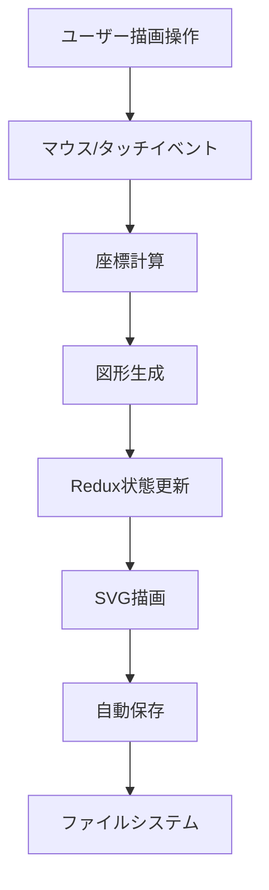
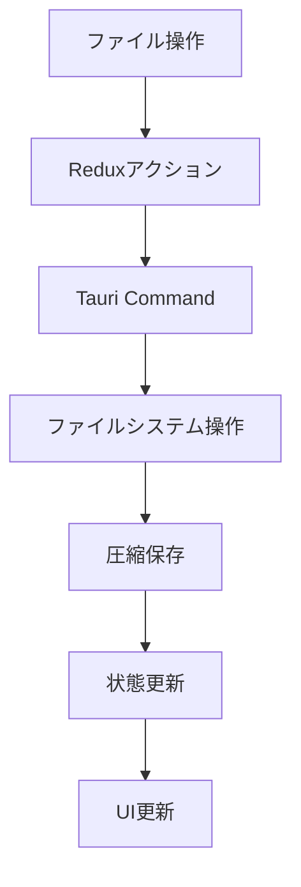

# データモデル設計書

## 1. 概要

Pointlessアプリケーションのデータモデルは、描画データ、ライブラリ管理、設定情報を中心に設計されています。すべてのデータはローカルファイルシステムに保存され、brotli-unicode圧縮により効率的に管理されています。

## 2. エンティティ関係図

```mermaid
erDiagram
    FOLDER {
        string id PK
        string name
        datetime createdAt
        datetime updatedAt
    }
    
    PAPER {
        string id PK
        string folderId FK
        string name
        array shapes
        datetime createdAt
        datetime updatedAt
    }
    
    SHAPE {
        string color
        number linewidth
        array points
        string type
    }
    
    SETTINGS {
        boolean isDarkMode
        string platform
        string appVersion
        string sortPapersBy
        number viewMode
        number canvasPreferredLinewidth
    }
    
    ROUTER {
        string name
        object args
    }
    
    FOLDER ||--o{ PAPER : contains
    PAPER ||--o{ SHAPE : contains
```



## 3. データモデル詳細

### 3.1 ライブラリ管理モデル

#### 3.1.1 Folder（フォルダ）

```typescript
interface Folder {
  id: string;           // UUID
  name: string;         // フォルダ名
  createdAt: string;    // ISO 8601形式の作成日時
  updatedAt: string;    // ISO 8601形式の更新日時
}
```

#### 3.1.2 Paper（ペーパー）

```typescript
interface Paper {
  id: string;           // UUID
  folderId: string;     // 所属フォルダのID
  name: string;         // ペーパー名
  shapes: Shape[];      // 描画図形の配列
  createdAt: string;    // ISO 8601形式の作成日時
  updatedAt: string;    // ISO 8601形式の更新日時
}
```

#### 3.1.3 Shape（図形）

```typescript
interface Shape {
  color: string;        // 色（HEX形式）
  linewidth: number;    // 線の太さ
  points: Point[];      // 座標点の配列
  type?: string;        // 図形タイプ（freehand, rectangle, ellipse, arrow）
}

interface Point {
  x: number;           // X座標
  y: number;           // Y座標
}
```

### 3.2 設定管理モデル

#### 3.2.1 Settings（設定）

```typescript
interface Settings {
  isDarkMode: boolean;              // ダークモード有効/無効
  platform: string | null;          // プラットフォーム情報
  appVersion: string | null;        // アプリバージョン
  sortPapersBy: string;             // ペーパーソート方法
  viewMode: number;                 // 表示モード（グリッド/リスト）
  canvasPreferredLinewidth: number; // デフォルト線の太さ
}
```

#### 3.2.2 Router（ルーティング）

```typescript
interface Router {
  current: {
    name: string;       // ルート名（'library' | 'paper'）
    args: object;       // ルート引数
  };
}
```

### 3.3 描画状態モデル

#### 3.3.1 Paper State（描画状態）

```typescript
interface PaperState {
  paperId: string | null;           // 現在のペーパーID
  userLastActiveAt: string;         // ユーザーの最終アクティブ時間
  librarySynced: boolean;           // ライブラリ同期状態
  selectedColor: string;            // 選択された色
  linewidth: number;                // 現在の線の太さ
  mode: string;                     // 描画モード
  eraserSize: number;               // 消しゴムサイズ
  clipboard: Shape[];               // クリップボード
  prevMode: string | null;          // 前のモード
  cursorX: number;                  // カーソルX座標
  cursorY: number;                  // カーソルY座標
  prevCursorX: number;              // 前のカーソルX座標
  prevCursorY: number;              // 前のカーソルY座標
  fixedCursorX: number | null;      // 固定カーソルX座標
  fixedCursorY: number | null;      // 固定カーソルY座標
  prevPinchDist: number;            // 前のピンチ距離
  isDrawing: boolean;               // 描画中フラグ
  isPanning: boolean;               // パン中フラグ
  isErasing: boolean;               // 消去中フラグ
  isSelecting: boolean;             // 選択中フラグ
  isMovingSelection: boolean;       // 選択移動中フラグ
  selectedShapeIndexes: number[];   // 選択された図形インデックス
  translateX: number;               // 平行移動X
  translateY: number;               // 平行移動Y
  forceUpdate: boolean;             // 強制更新フラグ
  scale: number;                    // スケール
  canvasElements: any[];            // キャンバス要素
  masks: any[];                     // マスク要素
  history: Shape[];                 // 履歴
  undoHistory: Shape[];             // アンドゥ履歴
  shapes: Shape[];                  // 図形配列
  currentShape: Shape;              // 現在描画中の図形
}
```

## 4. 定数定義

### 4.1 描画モード定数

```typescript
const MODE = {
  FREEHAND: 'freehand',     // 自由描画
  RECTANGLE: 'rectangle',   // 矩形
  ELLIPSE: 'ellipse',       // 楕円
  ARROW: 'arrow',           // 矢印
  SELECT: 'select',         // 選択
  PAN: 'pan',              // パン
  ERASE: 'erase'           // 消しゴム
};
```

### 4.2 線の太さ定数

```typescript
const LINEWIDTH = {
  SMALL: 2,    // 細い線
  MEDIUM: 4,   // 中程度の線
  LARGE: 6     // 太い線
};
```

### 4.3 ソート定数

```typescript
const SORT_BY = {
  NAME_AZ: 'name_az',                    // 名前（昇順）
  NAME_ZA: 'name_za',                    // 名前（降順）
  CREATED_DESC: 'created_desc',          // 作成日時（降順）
  CREATED_ASC: 'created_asc',            // 作成日時（昇順）
  LAST_MODIFIED_DESC: 'last_modified_desc', // 更新日時（降順）
  LAST_MODIFIED_ASC: 'last_modified_asc'    // 更新日時（昇順）
};
```

### 4.4 表示モード定数

```typescript
const VIEW_MODE = {
  GRID: 0,    // グリッド表示
  LIST: 1     // リスト表示
};
```

## 5. データフロー

### 5.1 描画データフロー



### 5.2 ファイル管理データフロー



## 6. データ永続化

### 6.1 ファイル構造

```
Library/
├── {folder_id}/
│   ├── folder_info.dat    # フォルダ情報（圧縮）
│   ├── {paper_id}.dat    # ペーパーデータ（圧縮）
│   └── ...
└── ...
```

### 6.2 圧縮方式

- **アルゴリズム**: brotli-unicode
- **形式**: JSONデータを圧縮
- **拡張子**: .dat

### 6.3 設定ファイル

- **場所**: アプリケーション設定ディレクトリ
- **形式**: JSON
- **内容**: ユーザー設定、アプリケーション設定

## 7. データ整合性

### 7.1 制約条件

- **フォルダID**: 一意性保証
- **ペーパーID**: 一意性保証
- **親子関係**: ペーパーは必ずフォルダに所属
- **日時**: ISO 8601形式での統一

### 7.2 バリデーション

- **必須項目**: id, name, createdAt, updatedAt
- **データ型**: 適切な型チェック
- **範囲チェック**: 座標値の妥当性確認

## 8. パフォーマンス考慮事項

### 8.1 メモリ管理

- **図形データ**: 効率的な座標管理
- **履歴管理**: 適切な履歴サイズ制限
- **キャッシュ**: 頻繁にアクセスするデータのキャッシュ

### 8.2 ファイルサイズ最適化

- **圧縮**: brotli-unicodeによる高圧縮率
- **差分保存**: 変更部分のみの保存
- **クリーンアップ**: 不要データの削除

## 9. 拡張性

### 9.1 新しい図形タイプの追加

```typescript
interface Shape {
  // 既存プロパティ
  type: 'freehand' | 'rectangle' | 'ellipse' | 'arrow' | 'newType';
  // 新しいプロパティの追加が可能
  newProperty?: any;
}
```

### 9.2 設定項目の拡張

```typescript
interface Settings {
  // 既存プロパティ
  // 新しい設定項目の追加が可能
  newSetting?: any;
}
```
