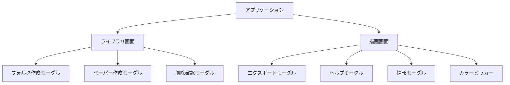

# 画面設計書

## 1. 画面構成概要

Pointlessアプリケーションは、主に2つの主要画面（ライブラリ画面、描画画面）と複数のモーダルダイアログで構成されています。

### 1.1 画面階層図



## 2. ライブラリ画面（Library）

### 2.1 画面概要

- **目的**: フォルダとペーパーの管理
- **主要機能**: フォルダ作成、ペーパー作成、削除、ソート、表示モード切り替え

### 2.2 画面レイアウト

```
┌─────────────────────────────────────────────────────────┐
│ ヘッダー                                               │
│ [ダークモード切替] [アプリ名] [バージョン情報]        │
├─────────────────────────────────────────────────────────┤
│ サイドバー                    │ メインコンテンツ        │
│ ┌─────────────────┐          │ ┌─────────────────────┐ │
│ │ フォルダ一覧    │          │ │ ツールバー          │ │
│ │ • フォルダ1     │          │ │ [+新規フォルダ]     │ │
│ │ • フォルダ2     │          │ │ [+新規ペーパー]     │ │
│ │ [+新規フォルダ] │          │ │ [ソート] [表示モード]│ │
│ └─────────────────┘          │ └─────────────────────┘ │
│                              │ ┌─────────────────────┐ │
│                              │ │ ペーパー一覧        │ │
│                              │ │ ┌─┐ ┌─┐ ┌─┐ ┌─┐   │ │
│                              │ │ │P│ │P│ │P│ │P│   │ │
│                              │ │ └─┘ └─┘ └─┘ └─┘   │ │
│                              │ │ ペーパー名          │ │
│                              │ └─────────────────────┘ │
└─────────────────────────────────────────────────────────┘
```

### 2.3 コンポーネント構成

#### 2.3.1 ヘッダー

- **ToggleDarkMode**: ダークモード切り替えボタン
- **アプリ名**: "Pointless"
- **バージョン情報**: アプリケーションのバージョン表示

#### 2.3.2 サイドバー

- **フォルダ一覧**: FolderListItemコンポーネントのリスト
- **新規フォルダボタン**: フォルダ作成機能

#### 2.3.3 メインコンテンツ

- **ツールバー**:
  - 新規フォルダボタン
  - 新規ペーパーボタン
  - ソート機能（Sortableコンポーネント）
  - 表示モード切り替え（グリッド/リスト）
- **ペーパー一覧**: PaperListItemコンポーネントのリスト

### 2.4 インタラクション

#### 2.4.1 フォルダ操作

- **フォルダ選択**: サイドバーのフォルダをクリック
- **フォルダ作成**: 新規フォルダボタンをクリック
- **フォルダ名編集**: フォルダ名をダブルクリック
- **フォルダ削除**: フォルダの削除ボタンをクリック

#### 2.4.2 ペーパー操作

- **ペーパー選択**: ペーパーアイテムをクリック
- **ペーパー作成**: 新規ペーパーボタンをクリック
- **ペーパー名編集**: ペーパー名をダブルクリック
- **ペーパー削除**: ペーパーの削除ボタンをクリック

## 3. 描画画面（Paper）

### 3.1 画面概要

- **目的**: 描画機能の提供
- **主要機能**: 描画、図形作成、選択、エクスポート、ズーム、パン

### 3.2 画面レイアウト

```
┌─────────────────────────────────────────────────────────┐
│ ヘッダー                                               │
│ [←戻る] [ペーパー名] [エクスポート] [ヘルプ] [情報]   │
├─────────────────────────────────────────────────────────┤
│ ツールバー                                             │
│ [自由描画][矩形][楕円][矢印][消しゴム][選択][パン]    │
│ [アンドゥ][リドゥ][クリア][ズーム][フィット]          │
├─────────────────────────────────────────────────────────┤
│ パレット                                               │
│ [色選択] [線の太さ] [ダークモード切替]                │
├─────────────────────────────────────────────────────────┤
│ キャンバスエリア                                       │
│ ┌─────────────────────────────────────────────────────┐ │
│ │                                                     │ │
│ │                SVG描画エリア                        │ │
│ │                                                     │ │
│ │                                                     │ │
│ └─────────────────────────────────────────────────────┘ │
└─────────────────────────────────────────────────────────┘
```

### 3.3 コンポーネント構成

#### 3.3.1 ヘッダー

- **戻るボタン**: ライブラリ画面に戻る
- **ペーパー名**: 現在のペーパー名表示
- **エクスポートボタン**: エクスポート機能
- **ヘルプボタン**: ヘルプ表示
- **情報ボタン**: アプリケーション情報表示

#### 3.3.2 ツールバー

- **描画ツール**:
  - 自由描画ツール
  - 矩形ツール
  - 楕円ツール
  - 矢印ツール
- **編集ツール**:
  - 消しゴムツール
  - 選択ツール
  - パンツール
- **操作ツール**:
  - アンドゥ
  - リドゥ
  - クリア
  - ズームイン/アウト
  - フィット表示

#### 3.3.3 パレット

- **色選択**: カラーピッカー
- **線の太さ**: 線の太さ選択
- **ダークモード切替**: テーマ切り替え

#### 3.3.4 キャンバスエリア

- **SVG描画エリア**: メインの描画領域
- **マウス/タッチ対応**: 描画操作
- **ズーム・パン対応**: 表示操作

### 3.4 インタラクション

#### 3.4.1 描画操作

- **自由描画**: マウスドラッグで線を描画
- **図形描画**: ドラッグで図形を作成
- **選択**: クリックで図形を選択
- **移動**: ドラッグで図形を移動
- **消去**: 消しゴムツールで図形を削除

#### 3.4.2 表示操作

- **ズーム**: マウスホイールまたはズームボタン
- **パン**: パンツールでキャンバス移動
- **フィット**: 描画内容に合わせて表示調整

## 4. モーダルダイアログ

### 4.1 フォルダ作成モーダル

- **目的**: 新しいフォルダの作成
- **入力項目**: フォルダ名
- **ボタン**: 作成、キャンセル

### 4.2 ペーパー作成モーダル

- **目的**: 新しいペーパーの作成
- **入力項目**: ペーパー名
- **ボタン**: 作成、キャンセル

### 4.3 削除確認モーダル

- **目的**: 削除操作の確認
- **表示内容**: 削除対象の確認メッセージ
- **ボタン**: 削除、キャンセル

### 4.4 エクスポートモーダル

- **目的**: 描画内容のエクスポート
- **選択項目**: ファイル形式（PNG/JPEG/SVG）
- **入力項目**: ファイル名
- **ボタン**: エクスポート、キャンセル

### 4.5 ヘルプモーダル

- **目的**: アプリケーションの使用方法説明
- **表示内容**: ヘルプテキスト
- **ボタン**: 閉じる

### 4.6 情報モーダル

- **目的**: アプリケーション情報の表示
- **表示内容**: バージョン、ライセンス情報
- **ボタン**: 閉じる

## 5. レスポンシブデザイン

### 5.1 デスクトップ対応

- **マウス操作**: クリック、ドラッグ、ホイール
- **キーボード操作**: ショートカットキー対応
- **画面サイズ**: 1024px以上

### 5.2 タブレット対応

- **タッチ操作**: タップ、ドラッグ、ピンチ
- **画面サイズ**: 768px - 1023px
- **タッチ最適化**: ボタンサイズの調整

### 5.3 モバイル対応

- **タッチ操作**: タップ、ドラッグ、ピンチ
- **画面サイズ**: 320px - 767px
- **簡略化**: ツールバーの簡略化

## 6. アクセシビリティ

### 6.1 キーボードナビゲーション

- **Tabキー**: フォーカス移動
- **Enterキー**: 選択・実行
- **Escapeキー**: モーダル閉じる
- **ショートカットキー**: Ctrl+Z（アンドゥ）、Ctrl+Y（リドゥ）

### 6.2 スクリーンリーダー対応

- **aria-label**: ボタンの説明
- **alt属性**: 画像の説明
- **セマンティックHTML**: 適切なHTML要素の使用

### 6.3 色覚対応

- **コントラスト**: 十分なコントラスト比
- **色以外の手がかり**: アイコン、テキストによる識別

## 7. パフォーマンス最適化

### 7.1 描画最適化

- **SVG描画**: ベクター形式による高品質描画
- **状態管理**: Reduxによる効率的な状態更新
- **メモリ管理**: 適切なコンポーネントライフサイクル

### 7.2 UI最適化

- **仮想化**: 大量データの効率的な表示
- **遅延読み込み**: 必要に応じたデータ読み込み
- **キャッシュ**: 頻繁にアクセスするデータのキャッシュ
