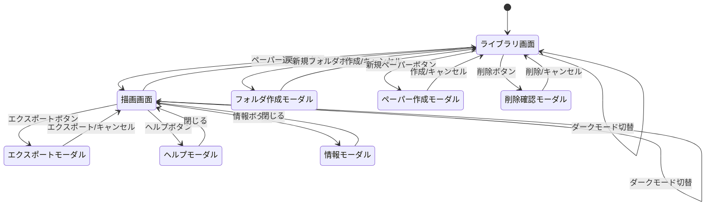
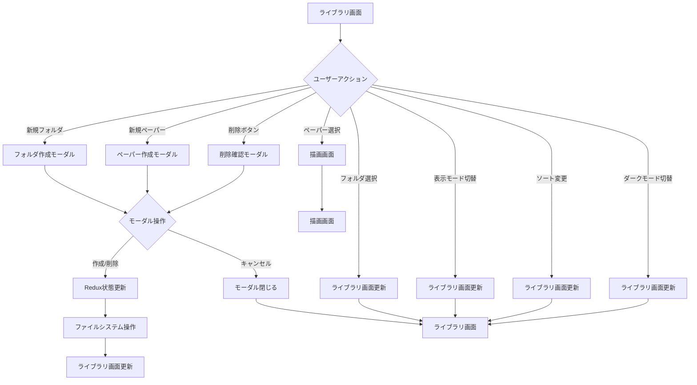
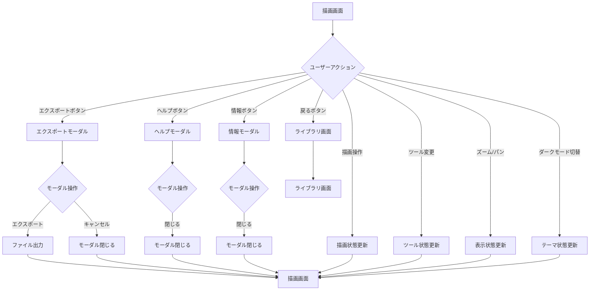
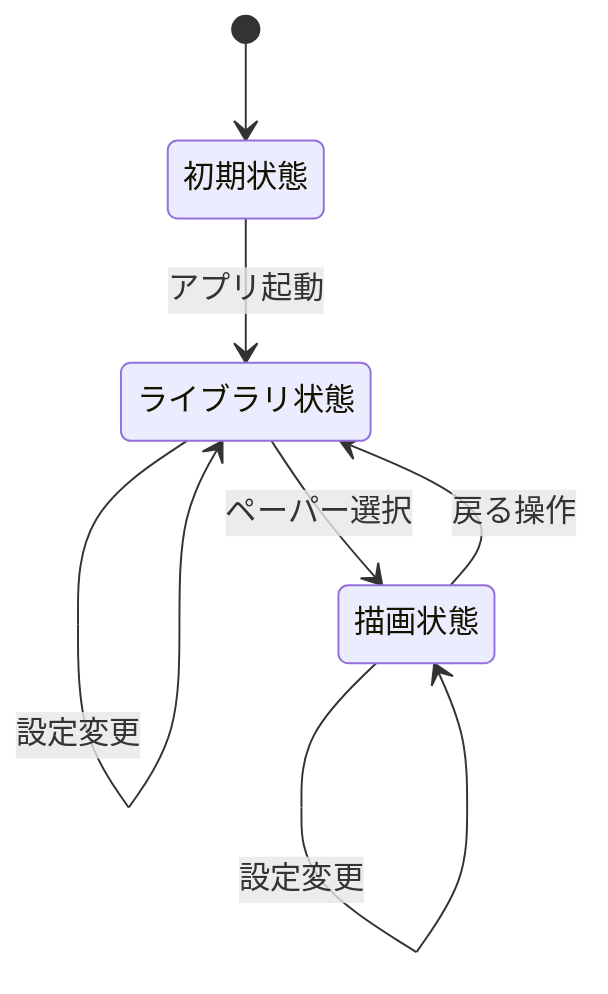
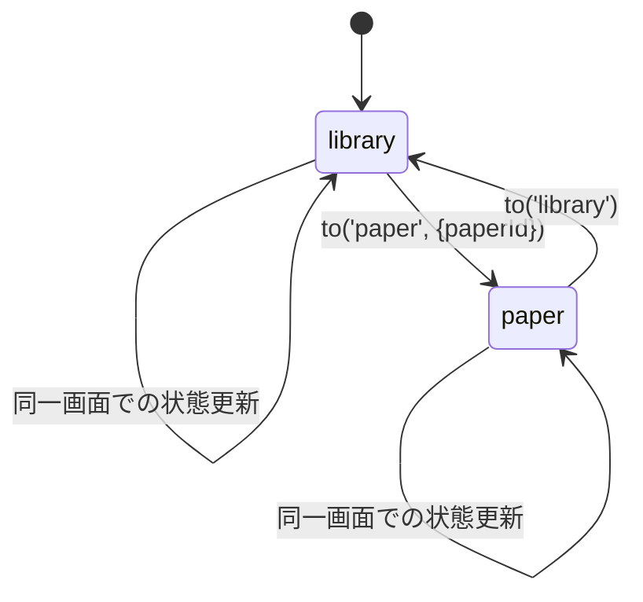
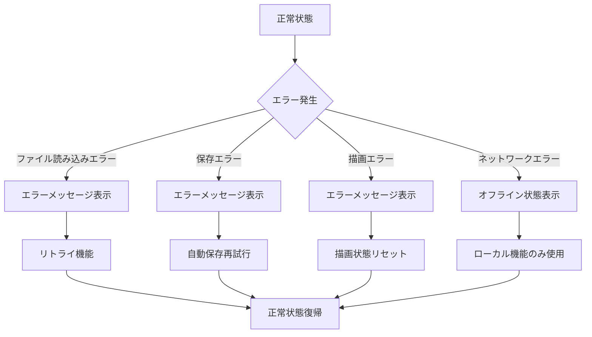
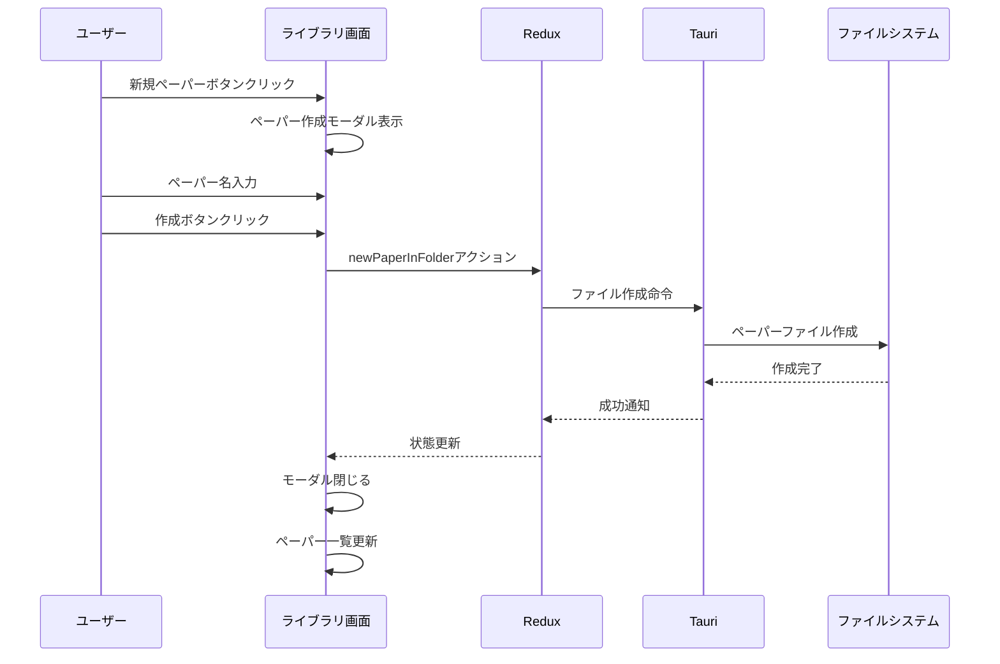
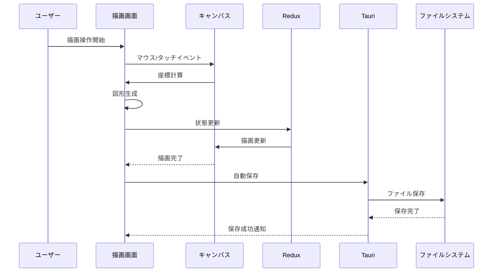

# 画面遷移図

## 1. 概要

Pointlessアプリケーションの画面遷移は、ライブラリ画面と描画画面を中心としたシンプルな構成になっています。各画面間の遷移とモーダルダイアログの表示フローを定義します。

## 2. 画面遷移図

## 3. 詳細遷移フロー

### 3.1 ライブラリ画面の遷移

### 3.2 描画画面の遷移

## 4. 状態管理フロー

### 4.1 Redux状態遷移

### 4.2 ルーティング状態

## 5. エラーハンドリング

### 5.1 エラー遷移フロー

## 6. ユーザー操作フロー

### 6.1 新規ペーパー作成フロー

### 6.2 描画操作フロー

## 7. パフォーマンス考慮事項

### 7.1 遷移最適化

- **遅延読み込み**: 必要な時点でのデータ読み込み
- **状態キャッシュ**: 頻繁にアクセスする状態のキャッシュ
- **非同期処理**: 重い処理の非同期実行

### 7.2 ユーザー体験

- **即座のフィードバック**: 操作に対する即座の視覚的フィードバック
- **プログレス表示**: 長時間処理の進行状況表示
- **エラー回復**: エラーからの自動回復機能
